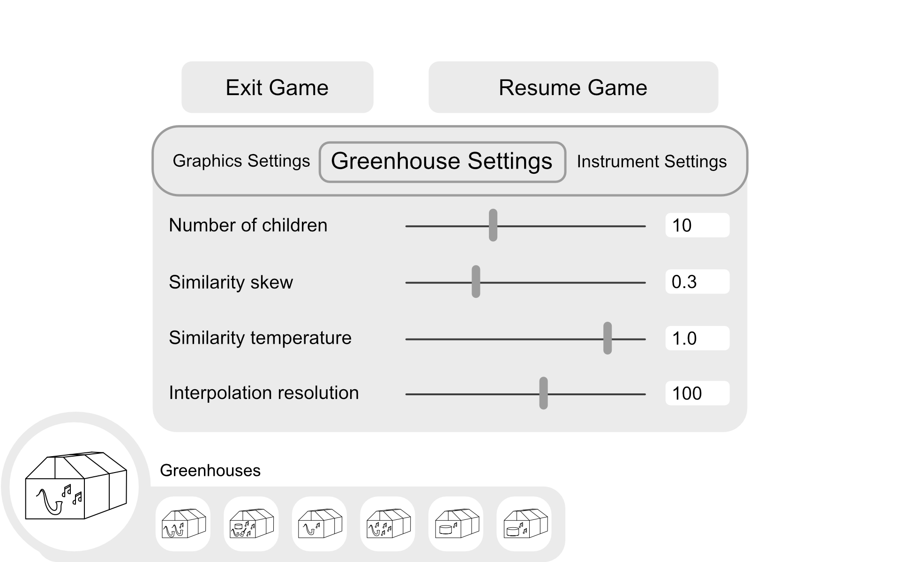
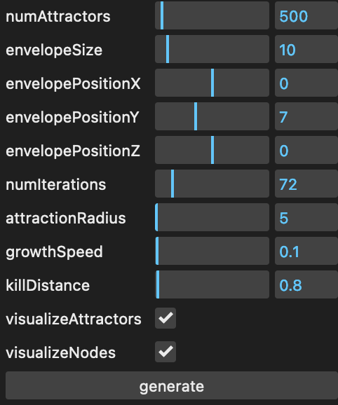
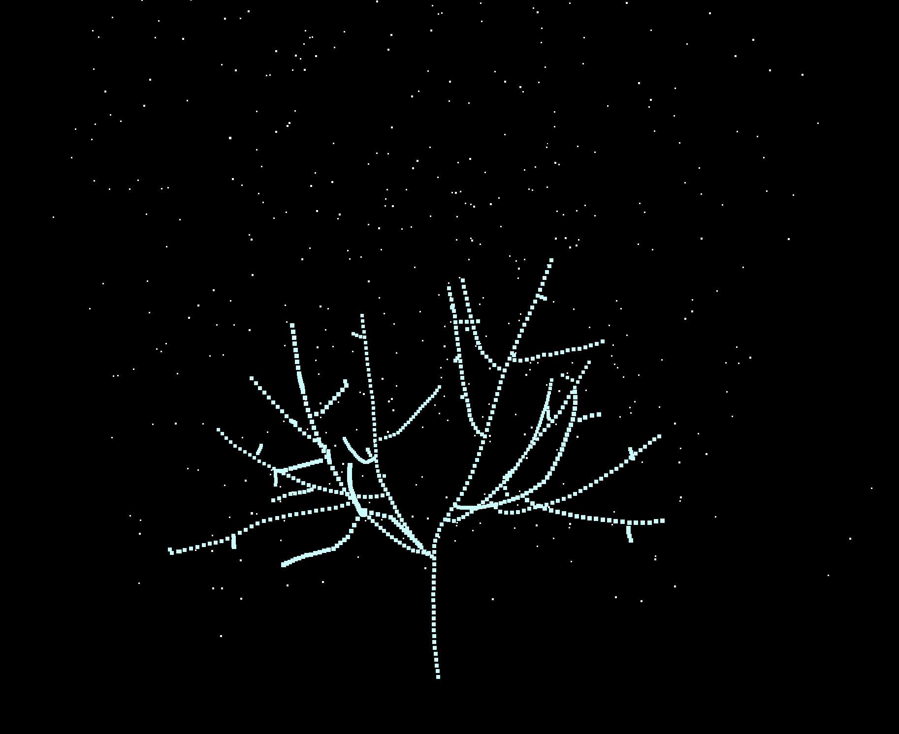
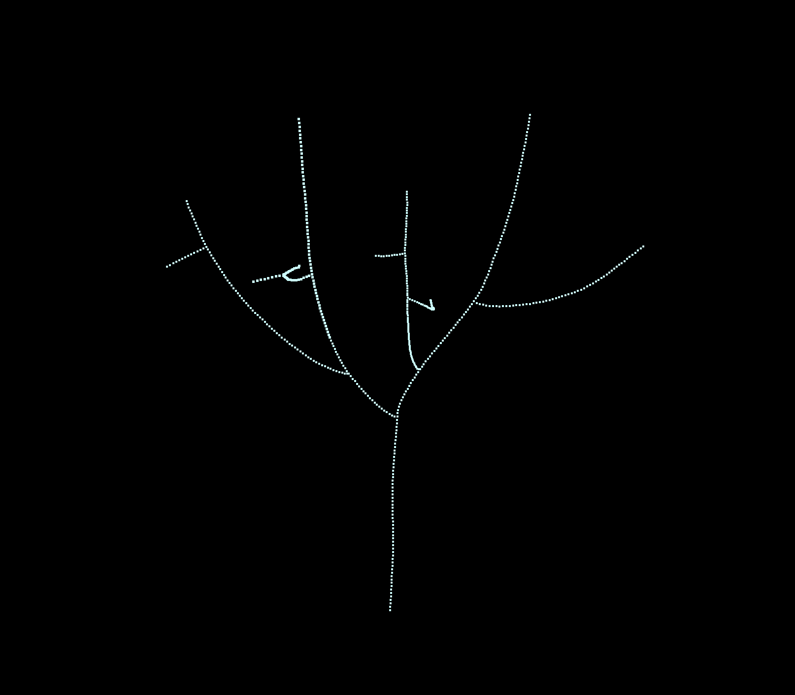
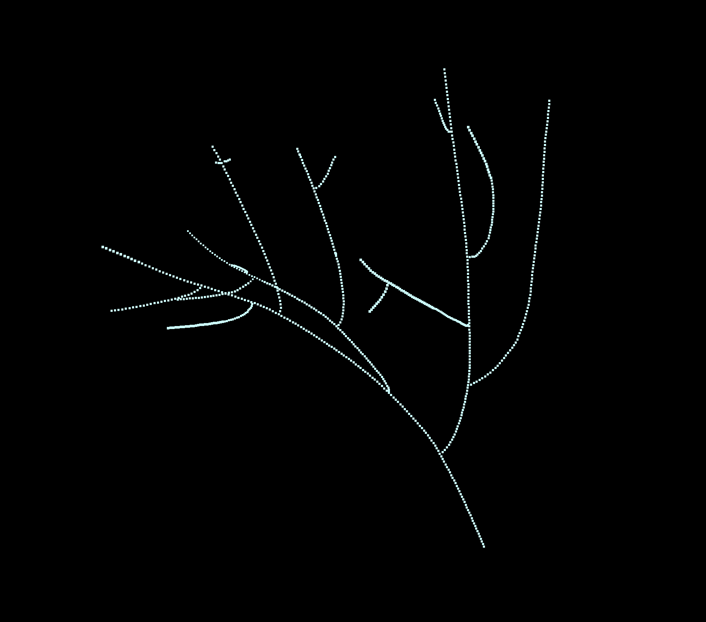
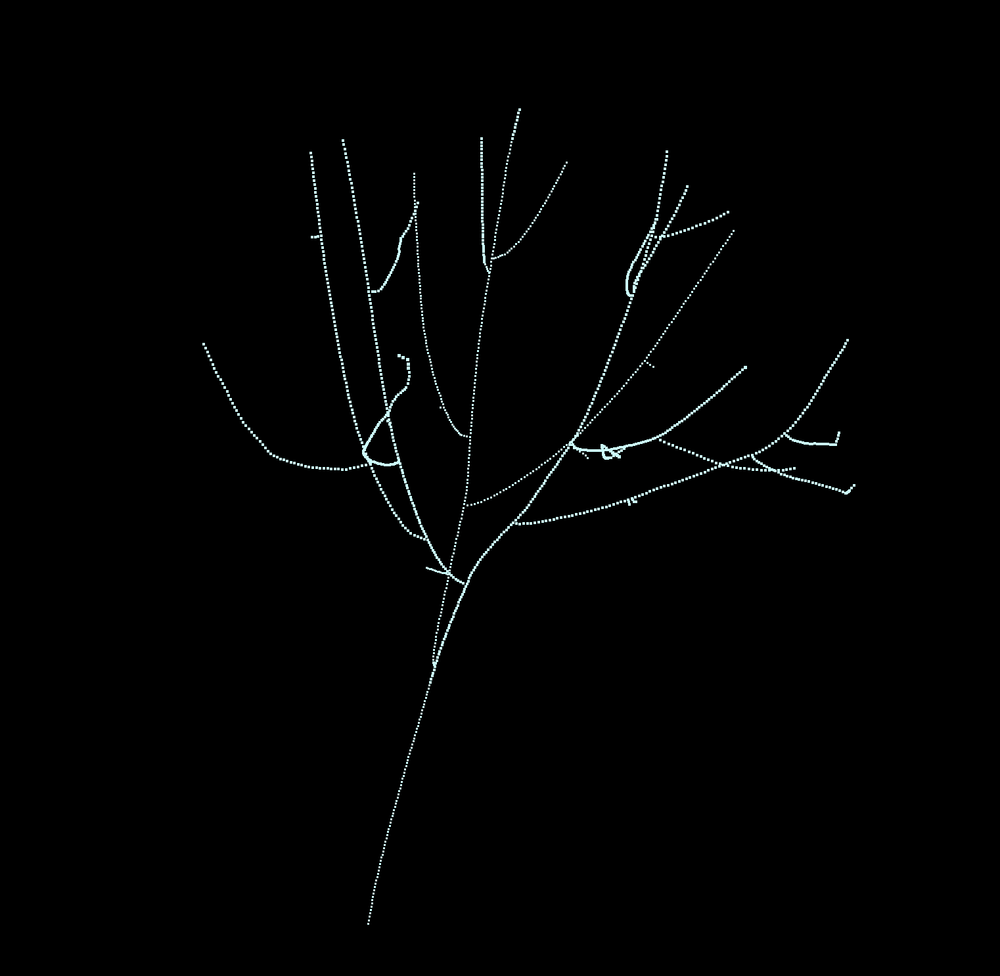
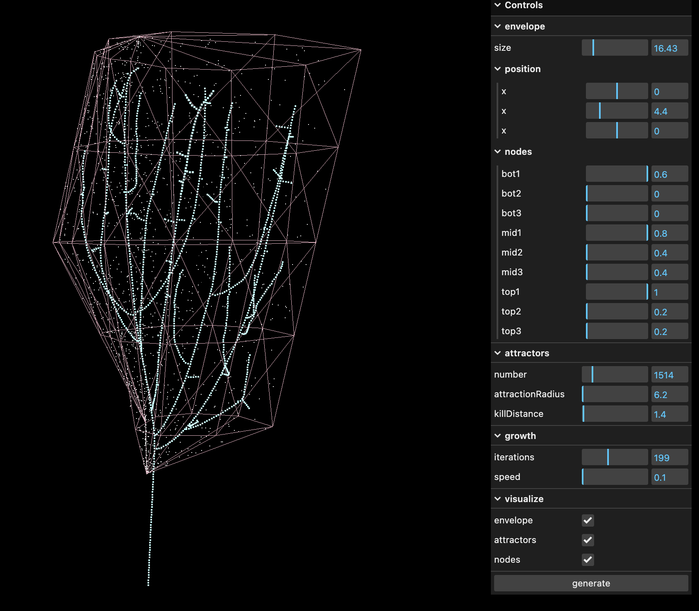

# Weekly Process Logs
## Week 1: January 10 - 14
The [Scope of Work](scope-of-work/README.md) document was created and signed this week.

## Week 2: January 15 - 21
Week 2 was the first real week of work on this project, as the first week was dedicated to administrative activities like planning. These administrative things are still very important though, and even this week was split between beginning development and still planning for the future.

This week when meeting with my advisor, we mostly discussed my scope of work document that I created last week. Matt also brought up a different kind of planning document that I could work on in addition to my timeline that I included in the scope of work. This second document is more of a requirements based spreadsheet, but much more detailed, and is focused on the overall user experience of the game from start-up to shut-down. I got a start on this document this week, but haven't made too much progress on it yet as I just met with Matt yesterday. My scope of work document made it clear that I still am not 100% committed on what the *exact* user experience I am developing, though I have a very good understanding of the feelings I want to convey and the overall broader shape and form of the deliverable. But I only outlined that in 4 broad and vague "objectives" bullet points, and I'm looking forward to working on this document so I can 100% understand myself what exactly it is that I am creating this semester. I haven't included that document in this repository yet because I'm not done with it, but next week's process log will certainly have a link to it.

As far as development progress goes, my general timeline layed out in the scope of work document says that this I am starting from scratch on a new generative plant algorithm. And that I am! I started out by reading several papers from the Biological Modeling and Visualization research group out of University of Calgary. I first discovered their website http://algorithmicbotany.org/ about a year ago when I was looking for some project ideas and inspiration while I was taking a course on biological modeling. They have done multiple papers outlining various different methods for computational models of plant and tree structures, and I hope that if I can't combine them all (or even just some of them) into my own personalized algorithm, I hope I can at least implement my favorite algorithm of them all. I have already gotten a start working on building up a space colonization algorithm based on the procedure outlined in [Modeling Trees with a Space Colonization Algorithm](http://algorithmicbotany.org/papers/colonization.egwnp2007.large.pdf) by Adam Runions et al. I chose to start with that algorithm as a base, and modify things from there, because it's the most interesting and enticing approach that I've read so far. But I hope to read even more papers, and hopefully include insights from them in my development process too. I've already read many great ideas that I'd like to look into including in the future, such as [L-systems](http://algorithmicbotany.org/papers/modeling-plant-development-with-l-systems.pdf), and [structural analysis](http://algorithmicbotany.org/papers/quantifying-the-degree-of-self-nestedness.pdf). But I can't include those ideas yet, because so far I have pretty much nothing. I have a solid-ish start on the space colonization algorithm, but only through numbers based debugging and testing, I have nothing exciting or visual to show in a process log. Next week there will be some very fun screenshots though, as I will have a much more solid algorithm in my hands by that time! And for now, I consider even my research to be enough progress, so I'm glad to have gotten a bit of a head start on the coding as well.

## Week 3: January 22 - January 28
Admittedly I am writing this process blog post on Saturday instead of Friday like I had intendid. So technically I am late on this one. But it's really fine because in effect, the weekly process post is just supposed to separate the work I've accoplished by the end of the day on Friday of one week from the work I will accoplish starting Saturday of the next week. And since I am writing this Saturday before I get anything else done on this project, I think it's still okay.

This week I accomplished a lot! And yet still I didn't quite accomplish everything I sought out to do or mentioned in my process log last week. Last week I mentioned I would be working primarily on 2 things this week: the new planning document, which I am calling "UX Macro Requirements," and the tree generation algorithm itself.

As for the UX Macro Requirements document, I last week said that I would have the document finished (at least to a good first draft state) and uploaded, but while working on the document, I realized it would actually turn out to be a much bigger, and much more important document than I initially thought it would be. I also realized that I would need to know more about what the final product I am creating actually is, before I can really get a good foundation going in the UX Macro Requirements document. So I'm deciding to upload the document in its work in progress state right now with this process post, but not link to it yet until next week when I have it much more filled out.

I did start to plan out how I might want the user interface to look, specifically how the user would change the various settings that control how the plants/music are bred together. In my Scope of Work document, which pretty much acted as a project proposal, I mentioned that I had pretty much two options for a lot of the actions I want the user to perform. One of the options, which may (or may not?) be the easiest option, is to include everything in a simple 2D UI/menu that pops up when the user presses the escape key. Another option which I think would be the most fun, but possibly a lot harder, is to include as many of these settings as 3D in-world sliders and knobs. There is also a third option, which is kind of a hybrid between the first two, where the separate menus are tied to separate and distinct objects/locations within the greenhouse, but the menus themselves are still standard 2D interfaces. That third option is probably the most likely because of the balance it strikes between conventional and unconventional. And I know that even if I mostly go for the second option, there still is going to be the occasional setting/action that has to be tied to a more standard menu, and for those cases, I'd fall back to the hybrid option. But for now I've just drawn a mockup UI for the very first option to help guide my UX Macro Reqirements doc. That mockup is featured below! Early next week, I plan on drawing a mockup for the second option as well, and possibly even the third.

As for the other task I had hoped to accomplish this week, I think I accomplished it beautifully. I had already made just a little bit of progress implementing the space colonization from Adam Runions et al., and all I had to do was make enough more progress implementing that algorithm that I had screenshots to share. And oh boy do I have screenshots to share!

The first step of the algorithm is to generate a set of "attraction points" that lie within a specified shape (the paper refers to this shape as the "envelope" so that's what I will call it from here on out too). I knew that a having customizable size, shape, and relative position of the envelope would be important to generating many various different plants (and using up as many dimensions of the MusicVAE's 256 dimensional latent space as possible), but the customizable shape part of that would pose at least a non-zero challange. So I just skipped right past that step, and generated a uniformly distributed random set of points inside a cube, because that's one of the easiest and quickest random sets of points to generate. However, two more of my goals for next week (in addition to the UX planning goals) are to add customizability to not only the shape of the envelope, probably through a solid of revolution method because that is what is mentioned in the paper, but also to the distribution of points within the envelope, because a uniform distribution is nice for some plants, but it would also be cool to create even more unique plants based off of a distribution that is skewed towards the outside of the envelope or the inside or even somewhere in between.

After the attraction points are generated, the first "node" of the stems/branches of the plant can be placed at the designated starting point (relative to the envelope), and then the successive nodes can be iteratively added to generate the plant. Each iteration contains 5-6ish steps to add nodes. First, every single attractor searches for nodes within a certain attraction radius of themselves. If there are node(s) close enough, then the closest node gets a list (if it doesn't exist already) of attractors that are affecting that node only, and that particular attractor is added to the list. Then for each node that has a list with 1 or more attractors affecting it, the direction from the node to each affecting attractor is averaged, and then a new node is added to the tree a specfied "growth speed" distance away in that direction. Then finally, once a node has reached an attractor point within a certain "kill distance" (which must be less than the attraction radius in order to sustain growth), the attractor point is removed from the overall set of attractors so that it is no longer affecting the rest of the plant's growth. To mess around with the parameters and find the best viable ranges for plants to be generated in, I created a simple GUI with sliders using a package meant for creative coding applications like this called lil-gui. And with this algorithm as it is, I've been able to create some pretty amazing plants, even without the envelope shaping and distributing that I will be incorporating next week!

## Week 4: January 29 - February 4
Similar to the week before, I had 2 major kinds of goals this past week. Some related to the overall planning of the project, more specifically the UX Macro Requirements document, and some goals related to actual development on the project itself. For the monster of a document that the UX Macro Requirements is turning into, I had a goal of getting a good solid first draft done by now, knowing that it is likely going to change througout the course of this project. It turned out to be *way* more work than I had anticipated, even though I already got a taste at how difficult this document was weeks prior. But I did indeed finish off a pretty good solid first draft of the document. The downside of it being such an in-detail document is that in order to write this process log on time instead of a day late like last week, I had to pretty much leave out 2 sections out of 6. But the upside of completing the most important 4 out of 6 sections is that I have *so so so so so so so* much better of an idea of what I'm doing with this plantsong breeding algorithm than I did before! Oh yeah, and that's another thing that the document helped me with: I came up with the name "plantsong" for the things the player is working with. They're both plants and songs! I'm not sure if the name is actually here to stay, but I like it for now.

It may just be a first draft, and maybe not *technically* complete, but it's still pretty damn full, so here's a link to the [UX Macro Requirements](ux-macro-requirements/README.md) document.

The second category of goals that I set for myself to complete this last week relate to the generative plant algorithm that I've been working on (inspired by the space colonization alogrithm from Adam Runions et al. of Algorithmic Botany, see previous process logs for links). For the plant generation algorithm I had hoped to do two things: add control over the shape of the envelope in which the attraction points were randomly generated, and also add control over the "random" distribution of the points within the envelope. Unfortunately I only had time to implement the first goal, controlling the shape of the envelope, and the second goal needs to be prolonged until first thing next week. But controlling the shape of the envelope was also a bit more challanging than I expected, and it's big news too! It means not only that we will make use of more of the 256 inputs that we will be offered into this plant generation algorithm, but also that the plants structures just look way more natrual, round, and variable. Take a look at one of the plants generated now with envelope shape control (as well as the temporary "debug" mesh showing the actual shape of the envelope):

Another thing I wanted to spend some time doing in the code this week, and got to, but didn't call out last week, was organize the code a little bit as well as organize the temporary "controls" panel that you can see off to the right side in the screenshot. That was really a minor side-track, and didn't really take away from the "random distribution control" that I didn't get to accomplishing this past week because that will be a pretty major task. In my Scope of Work document, I mention around one of these weeks that I want to look into making all of the randomness in this plant algorithm deterministic using a noise algorithm instead. I would take this on at the same time as controlling the distribution, because it kind of needs to be, and that's part of what makes it such a large task, and why I need to procrastinate it until next week. Incorporating this determinism and noise function behaviour is incredibly important though, because it will mean that very similar latent space vectors will end up generating very similar plants. In the end what that means is that parents and children and all their siblings will be much more likely to look like each other than plantsongs of different "genetics."

The fact that I didn't finish it this past week, and the fact that it's so important to the outcome of the project overall, means that accomplishing the plant (deterministic) random distribution is my number 1 goal for next week. But I also have some more goals, because February just started, which means we're coming up on the end of "early" development, and I need to start working on "mid-early" and even "mid" development tasks very very soon. So I really need to visualize these trunks and branches with cylinders of appropriate sizes this week too. And if I can, I'd like to also create some leaves, and plant accessories such as flowers and fruits, and as much variation amongst those as possible as well. It's kind of crunch time if I could get all of that done, but I almost feel like an "end of early-dev crunch/sprint" is a little bit necessary to jump-start this project back into gear again at this point.
