# Weekly Process Logs
## Week 1: January 10 - 14
The [Scope of Work](scope-of-work/README.md) document was created and signed this week.

## Week 2: January 15 - 21
Week 2 was the first real week of work on this project, as the first week was dedicated to administrative activities like planning. These administrative things are still very important though, and even this week was split between beginning development and still planning for the future.

This week when meeting with my advisor, we mostly discussed my scope of work document that I created last week. Matt also brought up a different kind of planning document that I could work on in addition to my timeline that I included in the scope of work. This second document is more of a requirements based spreadsheet, but much more detailed, and is focused on the overall user experience of the game from start-up to shut-down. I got a start on this document this week, but haven't made too much progress on it yet as I just met with Matt yesterday. My scope of work document made it clear that I still am not 100% committed on what the *exact* user experience I am developing, though I have a very good understanding of the feelings I want to convey and the overall broader shape and form of the deliverable. But I only outlined that in 4 broad and vague "objectives" bullet points, and I'm looking forward to working on this document so I can 100% understand myself what exactly it is that I am creating this semester. I haven't included that document in this repository yet because I'm not done with it, but next week's process log will certainly have a link to it.

As far as development progress goes, my general timeline layed out in the scope of work document says that this I am starting from scratch on a new generative plant algorithm. And that I am! I started out by reading several papers from the Biological Modeling and Visualization research group out of University of Calgary. I first discovered their website http://algorithmicbotany.org/ about a year ago when I was looking for some project ideas and inspiration while I was taking a course on biological modeling. They have done multiple papers outlining various different methods for computational models of plant and tree structures, and I hope that if I can't combine them all (or even just some of them) into my own personalized algorithm, I hope I can at least implement my favorite algorithm of them all. I have already gotten a start working on building up a space colonization algorithm based on the procedure outlined in [Modeling Trees with a Space Colonization Algorithm](http://algorithmicbotany.org/papers/colonization.egwnp2007.large.pdf) by Adam Runions et al. I chose to start with that algorithm as a base, and modify things from there, because it's the most interesting and enticing approach that I've read so far. But I hope to read even more papers, and hopefully include insights from them in my development process too. I've already read many great ideas that I'd like to look into including in the future, such as [L-systems](http://algorithmicbotany.org/papers/modeling-plant-development-with-l-systems.pdf), and [structural analysis](http://algorithmicbotany.org/papers/quantifying-the-degree-of-self-nestedness.pdf). But I can't include those ideas yet, because so far I have pretty much nothing. I have a solid-ish start on the space colonization algorithm, but only through numbers based debugging and testing, I have nothing exciting or visual to show in a process log. Next week there will be some very fun screenshots though, as I will have a much more solid algorithm in my hands by that time! And for now, I consider even my research to be enough progress, so I'm glad to have gotten a bit of a head start on the coding as well.

## Week 3: January 22 - January 28
Admittedly I am writing this process blog post on Saturday instead of Friday like I had intendid. So technically I am late on this one. But it's really fine because in effect, the weekly process post is just supposed to separate the work I've accoplished by the end of the day on Friday of one week from the work I will accoplish starting Saturday of the next week. And since I am writing this Saturday before I get anything else done on this project, I think it's still okay.

This week I accomplished a lot! And yet still I didn't quite accomplish everything I sought out to do or mentioned in my process log last week. Last week I mentioned I would be working primarily on 2 things this week: the new planning document, which I am calling "UX Macro Requirements," and the tree generation algorithm itself.

As for the UX Macro Requirements document, I last week said that I would have the document finished (at least to a good first draft state) and uploaded, but while working on the document, I realized it would actually turn out to be a much bigger, and much more important document than I initially thought it would be. I also realized that I would need to know more about what the final product I am creating actually is, before I can really get a good foundation going in the UX Macro Requirements document. So I'm deciding to upload the document in its work in progress state right now with this process post, but not link to it yet until next week when I have it much more filled out.

I did start to plan out how I might want the user interface to look, specifically how the user would change the various settings that control how the plants/music are bred together. In my Scope of Work document, which pretty much acted as a project proposal, I mentioned that I had pretty much two options for a lot of the actions I want the user to perform. One of the options, which may (or may not?) be the easiest option, is to include everything in a simple 2D UI/menu that pops up when the user presses the escape key. Another option which I think would be the most fun, but possibly a lot harder, is to include as many of these settings as 3D in-world sliders and knobs. There is also a third option, which is kind of a hybrid between the first two, where the separate menus are tied to separate and distinct objects/locations within the greenhouse, but the menus themselves are still standard 2D interfaces. That third option is probably the most likely because of the balance it strikes between conventional and unconventional. And I know that even if I mostly go for the second option, there still is going to be the occasional setting/action that has to be tied to a more standard menu, and for those cases, I'd fall back to the hybrid option. But for now I've just drawn a mockup UI for the very first option to help guide my UX Macro Reqirements doc. That mockup is featured below! Early next week, I plan on drawing a mockup for the second option as well, and possibly even the third.

As for the other task I had hoped to accomplish this week, I think I accomplished it beautifully. I had already made just a little bit of progress implementing the space colonization from Adam Runions et al., and all I had to do was make enough more progress implementing that algorithm that I had screenshots to share. And oh boy do I have screenshots to share!

The first step of the algorithm is to generate a set of "attraction points" that lie within a specified shape (the paper refers to this shape as the "envelope" so that's what I will call it from here on out too). I knew that a having customizable size, shape, and relative position of the envelope would be important to generating many various different plants (and using up as many dimensions of the MusicVAE's 256 dimensional latent space as possible), but the customizable shape part of that would pose at least a non-zero challange. So I just skipped right past that step, and generated a uniformly distributed random set of points inside a cube, because that's one of the easiest and quickest random sets of points to generate. However, two more of my goals for next week (in addition to the UX planning goals) are to add customizability to not only the shape of the envelope, probably through a solid of revolution method because that is what is mentioned in the paper, but also to the distribution of points within the envelope, because a uniform distribution is nice for some plants, but it would also be cool to create even more unique plants based off of a distribution that is skewed towards the outside of the envelope or the inside or even somewhere in between.

After the attraction points are generated, the first "node" of the stems/branches of the plant can be placed at the designated starting point (relative to the envelope), and then the successive nodes can be iteratively added to generate the plant. Each iteration contains 5-6ish steps to add nodes. First, every single attractor searches for nodes within a certain attraction radius of themselves. If there are node(s) close enough, then the closest node gets a list (if it doesn't exist already) of attractors that are affecting that node only, and that particular attractor is added to the list. Then for each node that has a list with 1 or more attractors affecting it, the direction from the node to each affecting attractor is averaged, and then a new node is added to the tree a specfied "growth speed" distance away in that direction. Then finally, once a node has reached an attractor point within a certain "kill distance" (which must be less than the attraction radius in order to sustain growth), the attractor point is removed from the overall set of attractors so that it is no longer affecting the rest of the plant's growth. To mess around with the parameters and find the best viable ranges for plants to be generated in, I created a simple GUI with sliders using a package meant for creative coding applications like this called lil-gui. And with this algorithm as it is, I've been able to create some pretty amazing plants, even without the envelope shaping and distributing that I will be incorporating next week!

## Week 4: January 29 - February 4
Similar to the week before, I had 2 major kinds of goals this past week. Some related to the overall planning of the project, more specifically the UX Macro Requirements document, and some goals related to actual development on the project itself. For the monster of a document that the UX Macro Requirements is turning into, I had a goal of getting a good solid first draft done by now, knowing that it is likely going to change througout the course of this project. It turned out to be *way* more work than I had anticipated, even though I already got a taste at how difficult this document was weeks prior. But I did indeed finish off a pretty good solid first draft of the document. The downside of it being such an in-detail document is that in order to write this process log on time instead of a day late like last week, I had to pretty much leave out 2 sections out of 6. But the upside of completing the most important 4 out of 6 sections is that I have *so so so so so so so* much better of an idea of what I'm doing with this plantsong breeding algorithm than I did before! Oh yeah, and that's another thing that the document helped me with: I came up with the name "plantsong" for the things the player is working with. They're both plants and songs! I'm not sure if the name is actually here to stay, but I like it for now.

It may just be a first draft, and maybe not *technically* complete, but it's still pretty damn full, so here's a link to the [UX Macro Requirements](ux-macro-requirements/README.md) document.

The second category of goals that I set for myself to complete this last week relate to the generative plant algorithm that I've been working on (inspired by the space colonization alogrithm from Adam Runions et al. of Algorithmic Botany, see previous process logs for links). For the plant generation algorithm I had hoped to do two things: add control over the shape of the envelope in which the attraction points were randomly generated, and also add control over the "random" distribution of the points within the envelope. Unfortunately I only had time to implement the first goal, controlling the shape of the envelope, and the second goal needs to be prolonged until first thing next week. But controlling the shape of the envelope was also a bit more challanging than I expected, and it's big news too! It means not only that we will make use of more of the 256 inputs that we will be offered into this plant generation algorithm, but also that the plants structures just look way more natrual, round, and variable. Take a look at one of the plants generated now with envelope shape control (as well as the temporary "debug" mesh showing the actual shape of the envelope):

Another thing I wanted to spend some time doing in the code this week, and got to, but didn't call out last week, was organize the code a little bit as well as organize the temporary "controls" panel that you can see off to the right side in the screenshot. That was really a minor side-track, and didn't really take away from the "random distribution control" that I didn't get to accomplishing this past week because that will be a pretty major task. In my Scope of Work document, I mention around one of these weeks that I want to look into making all of the randomness in this plant algorithm deterministic using a noise algorithm instead. I would take this on at the same time as controlling the distribution, because it kind of needs to be, and that's part of what makes it such a large task, and why I need to procrastinate it until next week. Incorporating this determinism and noise function behaviour is incredibly important though, because it will mean that very similar latent space vectors will end up generating very similar plants. In the end what that means is that parents and children and all their siblings will be much more likely to look like each other than plantsongs of different "genetics."

The fact that I didn't finish it this past week, and the fact that it's so important to the outcome of the project overall, means that accomplishing the plant (deterministic) random distribution is my number 1 goal for next week. But I also have some more goals, because February just started, which means we're coming up on the end of "early" development, and I need to start working on "mid-early" and even "mid" development tasks very very soon. So I really need to visualize these trunks and branches with cylinders of appropriate sizes this week too. And if I can, I'd like to also create some leaves, and plant accessories such as flowers and fruits, and as much variation amongst those as possible as well. It's kind of crunch time if I could get all of that done, but I almost feel like an "end of early-dev crunch/sprint" is a little bit necessary to jump-start this project back into gear again at this point.

## Week 5: February 5 - 11
Similar to two weeks ago, I'm *technically* writing this entry a day late, but also because I didn't make any progress this weekend, the actual date that I write this process log *effectively* doesn't matter. I hoped to really make a lot of progress last week, so that I could officially end "early development," which consisted of creating the plants themselves, and move on to "early-mid" and "mid development," which will consist of putting the plants inside the greenhouse itself. While I didn't make as much progress as I had hoped, and I will need to spend just a half week more in "early development," I still made a lot of progress this week that I'm pretty proud of.

My first accomplishment this week was to improve my control over the random attractor points that are at the core of the space colonization algorithm.I started out by making these random points not random at all, but just seem that way. The simplest way for me to make things look random but actually be deterministic would be for me to just set a random seed, and then proceed on my merry way with regular "randomness" that is determined by the seed. But if I had done it that way, then the set of attractor points from one plant compared to another would be equally as different regardless of how similar the "genetics" (the MVAE latent space vector is the genetics) of the two plants are. I wanted not only determinism, but also scaling similarity. In order to accomplish both at the same time, I used simplex noise, where if the noise value is above a certain threshold at a sample point, then an attractor point is created there. Values such as the threshold, sampling frequency, and sampling offset in each of the three dimensions, can all then be controlled by the plant's genetics. That way, plants with similar genetics will have attractor points in very similar locations, and they will have even more similar structures than if I hadn't implemented scaling similarity alongside deterministic attractor point placement. After I had successfully implemented the determinism, the next part of controlling the attractor points was to control whether they are distributed evenly throughout the envelope, or if there are more attractor points at the center or edges of the envelope. Implementing the determinism the way I did (through noise) actually helped make implementing this distribution control a lot easier, because all I had to do was scale the threshold value based on the radius of the point in cylindrical coordinates. The picture below shows a set of attractor points that was generated with the distribution controlled such that the points are all close to the edge of the envelope, and there are practically no points that are generated near the center.

After implementing a brand new method (and in my opinion very cool method) to control the distribution of the random attractor points, my next goal for this week was to start visualizing the trunks and branches of the trees with cylinders and cones that are scaled to the right size in order to make it look like an actual plant/tree. I based my method on the one outlined in the paper that I based the original space colonization algorithm on. The authors didn't describe it in too much detail, but the mentioned that they started at the tip of every branch and work towards the root node at the base of the tree, slowly increasing the radius of the cylinders as we move farther and farther down the tree, and wherever two branches meet, the resulting singular branch has a radius that is a combination of the two branches that met. Before I could implement any such methods to determine the branch's raduis at each node, I first needed to modify my original space colonization algorithm so that I actually could mathematically traverse the nodes as a tree. When I first coded the space colonization algorithm, I just threw all the nodes into a list where order and children and parents and everything matter 0%. So I needed to create an actual tree data structure (just like in undergraduate computer science courses) before I could move on. Once I did implement both the tree structure and the basic radius-determining-method, I initially had problems assuming that there would only ever be two branches joining together into one. Based on the algorithm, no branch should ever be able to split into more than two branches at a time, three and more should be impossible. But for some reason when I accounted for these impossible scenarios, and pretended they were possible, everything else started working again! I'm sure I changed and fixed something else while I was at it, and didn't fully realize it at the time, but I'm not complaining. I think the result of this method are truly amazing! I'm able to create just as good looking, if not better, trees than they feature in the paper, and I think these plants are almost perfect to be tied to musical genetics and then placed inside a magical musical greenhouse.

Last week I also mentioned that I wanted to create leaves and other plant "accessories" such as flowers and fruits, and possibly even more. This is where I fell short, and didn't achieve my goals. I think those are the last thing(s) I need to do in order to make these plants "complete" and ready to move on to the next stage. Because I didn't finish them this past week, but I still feel like they are completely necessary, I think I need to extend this stage of development by another half a week at the least. So unfortunately this doesn't get to be a milestone process log where I'm moving on from early development, but that's okay, it just means that next week's process log will be the real milestone. So by next week's process log, I will have completed adding all the different plant "accessories," which will be the end of early development. And then maybe I will have time to also get started on mid development where I will be placing these plants into the greenhouse and tieing the plant's up to their musical genetics.

## Week 6: February 12 - 18
I mentioned this to my advisor in my most recent meeting, but this week is the first week where I'm really truly feeling behind, and I have to start making adjustments to compensate for that. But hopefully by making small adjustments to the schedule now means I can avoid bigger adjustments later down the line. Last week I kind of already made adjustments saying that I was pushing working on the leaves and flowers (and other plant "accessories") until the first half of this week, which it was originally not planned for. But this week I had to make further adjustments by dropping the flowers and extra plant accessories until later on in the project *if* I ever get to a point where I know I'll have extra time. I still did work on creating procedurally generated leaves to add to the plant though! This was a bit of a challange transforming from world to local space to get the right rotation of the leaves and everything, so for now they are just simple ovals. But later on down the road, just like the flowers, if I feel like I'm coming up on extra time, I can come back and make the leaves look prettier. For now they still look pretty good!

After getting basic leaves on the trees, it was time for me to move on to the original purpose of this week, which is to start the second phase of development, where I create the greenhouse that surrounds the plants as well as everything else that is needed in the greenhouse for gameplay. If you look through my more ambitious ideas in the UX Macro Requirements document, there's a lot of 3D models that I'd like to create to mimic settings but with in-game objects. I'm still a beginner when it comes to 3D modeling, so I decided that spending 4 hours on watching (and following along with) more tutorials on how to efficiently use Blender (the software) would help save me more than 4 hours later on down the road. But what it does mean for now is that I only finished making my first object instead of my first two objects like I had originally hoped to finish by the end of the week. That object is the main workbench(es) that the plants will be sitting on! I'm very excited with how it turned out, here's a screenshot of the bench in Blender:

I haven't bothered loading in the bench and placing it into the game yet, because I finished it up right before writing this process post. But it shouldn't actually be very much work at all for me to do that first thing next week, because before working on the bench model, I prepared for it by setting up systems in the code to load in various resources like textures and models. I tested out these systems by loading in a simple gradient skybox, which you probably notice as new in the picture of the plant above, but they should be ready to load in my new model without any extra coding work needed, so I'm excited to give those systems (I'm calling it a "resource manager" in the code by the way) a try next week!

## Week 7: February 19-25
For most of this week, I was fully engaged in blender creating new models for the game, and it was very fun! I started by adding materials to the workbench model that I created at the end of last week. After that, I created yet another bench... but this time it's a different bench! I always wanted two kinds of benches in this game, one that automatically got filled up by the generation process (but that also was cleared out upon each generation too), and one that was meant for saving the plants accross generations, or possibly just for displaying or showing off. I've decided to call these other benches "showbenches" and they are supposed to look a lot nicer because of their showy off status.

After the showbench, I decided to try my hand at creating a plant pot for the plants to sit in. The model itself ended up being pretty basic, because I'm still very much learning and improving my 3D modeling skills over time. But I tried my hand at texture painting so that I could have different colors on diffrent parts of the same object within the model. This was my first time doing any texture painting in Blender, so it's a little rough, but I don't think anyone will really be able to look close enough to care :)

The final model I worked on this week was the actual greenhouse itself! Except I wasn't sure how I wanted to handle the material look of the semi-transparent diffuse panels yet, so I only worked on the frame for now, and I'll add the panels next week when I add the environment map and new skybox (I'll talk about my next week goals after all the pictures).

Once I had gotten a good handful of models done, I figured it was time to really load them into the game properly. And that was pretty much as easy as exporting them all as GLTFs, and adding the paths as entries to the "resources" array in `src/Managers/ResourceManager/resources.ts` and they were there! So I'm really happy for that Resource Manager that I worked on at the beginning of last week, it made my life really easy. After getting the models into the game, I just barely moved them around so that they were separated from each other, and I could get a good look around them. And finally I added in a first person controller that could walk around and experience the models as if they were in the world.

You may notice that all of the models colors look a lot different in the game than they look in Blender. There's a couple of reasons for that, and I intend on fixing all of them, but the most important one is the environment map. The default environment map in a Three.js scene is just black, meaning that any material that has a decently high metalic property (such as the greenhouse frame), just looks way darker than they are supposed to. In Blender, the default environment map is some generic blurry greenery, which is pretty much exactly what I need, except maybe I need it even blurrier so that I can use it as the sky box too and that would mimic the diffuse greenhouse panels possibly (hopefully). I will probably be creating my own texture for this, or at the very least heavily modifying something that I find online. But the main goal for next week is to beautify the enviornment! Goal number two is kind of included, but to add panels to the greenhouse frame. And then goal three is that I also hope to create a pretty solid first draft for my most complex model to come out of Blender yet: the Combinator Machine (name still subject to change... used to call it the breeding machine in the past but didn't like that lol). I certainly won't have implemented any of the functionality of the machine into the game yet, but if I can get some work done on the model, that will be very exciting!

## Week 8: February 26 - March 4
This week I had a big(ish) playtesting session/presentation for my other major project this semeseter, and that was taking up 100% of my time and attention until I got it finished. Which means I actually only worked on this project for 2 days this past week. But that's okay, because my goals weren't too big, and so I was pretty much able to meet them, and even exceed them in a way too! The main goal for last week was to overall improve the look of the game, and the number one way to do that was to add an environment map for the metalic materials to show fake reflections of.

By default in three.js, the environment map is just black, meaning metalic objects are really just fake reflecting black, which just makes them really really dark. This was especially a problem in my case with the metal frame of the greenhouse that just looked pure black in the screenshot last week. I found a nice looking creative commons liscenced "hdri" environment map, and edited it myself to my own liking. The primary change I made to the environment map texture was to make it very blurry, which when I swap this texture for the skybox as well, will do all the "diffuse" work of the greenhouse panels so that I don't have to write a complicated shader or anything (yet) at all, though I also edited the texture for brightness and contrast. I thought that finding and editing the texture would be the hard part for me, and the easy part would be loading it into the game as an environment map. I hadn't incorporated any environment maps in this project yet (just a skybox, which is the other half of the coin), but I just did it in another project less than a month ago, surely I just had write the same code but swap it for my texture and it would work... right? Uhhhh, unfortunately no. I just absolutely could not get the environment map to work, and it was defeating me for hours on end.

Eventually I was so frustrated that I decided to practically start the whole codebase from scratch and give it a 100% complete restructure. To be honest, there's a bit more context as to why I'm doing the restructure, and it mostly has to with lessons I've learned from the other game I'm working on this semester (that I mentioned at the beginning of this process update), but I absolutely was not planning on doing it so soon, and it was the environment map frustration that prompted me to do so. It also wasn't exactly like I was starting from scratch, because I still had my old codebase up next to it side by side that I could copy and paste code snippets of. Really most of the algorithms and logic that I've developed this entire first half of the semester stayed the same, it's just the structure, the order in which things are happening, and the flow of data between various parts of the program, are all alot more organized and robust. And on top of that, I should hopefully actually have to write less boiler plate code to keep this project maintained and moving in the future, so I'm definitely excited about that. I actually found out just about a quarter of the way through the code re-write that my entire issue with the environment map was actually just an issue with the version of three.js that I was using. I upgraded from version 136 to 138 and my environment map worked perfectly! In fact I could even have gone back to my old code at that time and not done the rest of the three quarters of the re-write, but I was already rolling on that re-write and wasn't in the mood to turn back, especially not with all the improvements I was hoping to continue making. So I just kept going, and I'm glad I did! Like I mentioned earlier, the code is just so much nicer now, and even though I would have been okay moving forward with that previous structure, this structure could hopefully help me move quicker, and possibly even catch up on lost time. So that's the way that I exceeded my expectations from last week's process update.

To finish off the visual updates to get the game looking all pretty, I changed the color encoding of the renderer to sRGB, and added a mild fake-HDR effect as well that tries to give the render a more realistic look. I might change which fake-HDR filter I use in the future, as I might decide on a more cartoony look (because my grass texture is already so saturated that it might as well be cartoony), but just any filter right now is an improvement over how things looked before. After that I also added semi-transparent panels (no blur effect yet) to the frame of the greenhouse, so now it's a fully complete greenhouse. I also added a floor with a (possibly) temporary grass texture, and then as the final cherry on top, scaled and arranged the benches in the greenhouse to give it a more full look closer to how it will be in the final game. And with that I have a screenshot of the greenhouse really finally coming together!

## Week 9: March 5 - 11
I recently realized that it's been a while since I last checked back in on my original timeline that I tried laying out in the scope of work document at the beginning of the semeseter. Near the beginning of the semester I was following along with it quite well, but in recent process updates I've kinda forgotten about it. Checking back in on it now it's clear that although I feel really great about where I currently am progress wise, it's nowhere even close to where I thought I would be right now in that predicted timeline.

Like I said though, I feel great about where I currently am, and I don't actually feel behind at all, rather just on an adjacent path, that will still converge in the end, but I think result in a better project in the end. One of the big differences between the paths is the speed at which I'm reaching MVP. On the path that I originally laid out for myself at the beginning of the semester, I would have reached some sort of MVP by the end of a week ago right now. Whereas on the path I am currently on, I wont really have reached an MVP until another week from now. A big reason why I'm currently predicting right now that I'll reach my MVP 2 weeks after I initially intended is because now I think the MVP that I will be reaching will be *way way* less crappy, and actually close to a complete and full experience. Wheres if I had followed the original timeline and pushed to reach an MVP by the end of week 8, then it would have just felt like another crappy prototype to me instead of a true MVP. So what am I actually doing different about this timeline compared to the original? Well in the original timeline I would just right now be starting to think about a truly good user interface and user experience, but in the real timeline, my advisor convinced me to start thinking about those important pieces to the puzzle way earlier. This resulted in the UX Macro Requirements document, and eventually influenced me to get started on the user interactions way sooner than initially planned. So on this timeline, instead of just shoving the machine learning music bits in there and calling it an MVP, I'm actually focusing on implementing fun and useable interface for the player to interact with before I bother with the music stuff. The reason I think this will result in a way better product in the end is because I will have had way more time to perfect the "unkowns", and I'm saving the "knowns" for the end because I know they will need less time.

All that said, what progress did I make this week? Well I started to implement many of the game's core interactions like clicking on bench spaces. For now I'm just generating a random plantsong when clicking a bench space, but in the future the plan is that clicking will pick up a plantsong (if it's on the bench and not in your hands) or place down a plantsong (if there's an open space on the bench and a plansong in your hands).

I also figured as I'm getting closer and closer to a good MVP, it was about time I looked into hosting it somewhere on the web... I've been designing it for the web this whole time but haven't put it up there anywhere yet. But better late than never! I'm trying to move away from hosting all my projects *within* my website and instead use my personal website mainly as a portfolio that contains (external) links to my works. I especially want those links to be external for a project that I hope to be actually big and great and everything (which hopefully this project is). So I started shopping around for domains, which is honestly really fun for me! My personal website's domain is [peter.rosenth.al](https://peter.rosenth.al/), which makes use of a country's top level domain (the .com, .net, or in this case .al for Albania part of the url) as like part of a pun to create my actual name. I was interested in doing something similar for Beat Greenhouse, and luckily for me, Sweden's top level domain is .se, and I was able to snag beatgreenhou.se for pretty dang cheap! Some countries have restrictions on who can buy and own their domains, but Sweden (like Albania) is a very nice country when it comes to their domains, and they let almost anyone buy them, so thank you Sweden :)

I decided to go with Vercel as a "serverless" hosting solution, which I've just discovered recently in the past for my personal website. It makes a lot of things incredibly easy for developers, and you basically just set it up to watch a git repository for changes, build the changes and deploy them to the url automatically. It's a very convenient "continuous deployment" pipeline that allows me to have an always up to date live webpage for literally no more work than I'm currently doing (committing and pushing to git regularly). So go on over to [beatgreenhou.se](https://beatgreenhou.se/) to experience the game in whatever the most currently up to date version it is in!

The final big change I worked on this week was creating the "machines" that do all of the plantsong interactions: importing midi files, combining two plantsongs together, playing the song part of a plant out loud. I got to spend a lot of time in Blender this week improving my 3D modeling skills, and I came out of it with three new models that I'm pretty proud of! There still is likely to be iteration and improvement on these models in the future, but I'm pretty happy with how they look now. The names I ended up going with for the machines are: the Genesis Machine, which has the ability to create new plantsongs out of just thin air (and midi data); the Combinator Machine, which has the ability to combine two plantsongs together and create a greenhouse full of children; and the Interpreter Machine, which has the ability to interpret the song within a plantsong and play it out loud for the player to hear. My only picture for this week is included below, and it's the new machines in game! From left to right: the Combinator Machine, the Interpreter Machine, and then the Genesis Machine. For now they are just models and not functional yet, but my number one goal for next week is to implement the machine learning and music stuff from my previous prototypes on this project, and incorporate that into the functionality of the machines. And at that point I will truly be at a pretty dang good MVP, so I'm really looking forward to it!

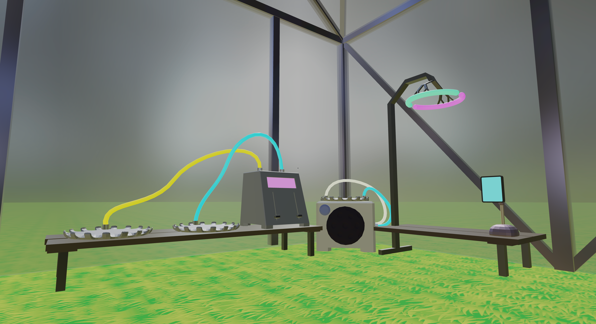

## Week 10: March 12 - 18
The title says March 12 - 18th because that's when this process log was supposed to cover, but unfortunately that's a lie, and just as I was supposed to be "finishing up the week" I encountered an issue I considered so important that I couldn't ignore it and fixing it became a higher priority than writing this process update for the last few days. And despite working that extra time I still haven't accomplished the main goal that I set out for myself because I really wasn't using that work time for extra progress, I was bug hunting instead. I'm fine with that however, because I made some really satisfying progress during the beginning most part of last week and I'm not worried that I'll still be able to catch up now.

Last week should have started with me implementing the MVAE importing and interpolating features to the game right away, but I knew that using those features would involve interacting with the machines that I had created the previous week, and I wanted a good way to indicate to the player the interactions they were performing. That "good way" that I really really wanted was an highlight/outline on the interactable objects if the player looks at them, and I knew that if I wanted to do this effect in a performant way I would have to learn how to use shaders. Shaders and computer graphics programming is something that I've been wishing to get into for such a long time, but it's always seemed so complicated and scary, and I never felt like I had the combined time and incentivet until this week. So I went back to [Bruno Simon's Three.js Journey course](https://threejs-journey.com/) to take the shaders chapter of it. I haven't mentioned this course yet in this entire process blog page yet, but it's an awesome vast collection of video and written lessons on learning the ins and outs of Three.js (the main library behind the 3D part of my game) and even WebGL in general, the core fundamental web framework that Three.js is based on top of. I started taking the course over winter break in preparation for creating this game this semester. I had to put a pause on my taking of the course right before the start of the chapter on Shaders because the semester started and I had already covered pretty much everything else in the course, so I felt like it would be a better use of my time to work on the project instead of finishing the course at the time; plus like I said: shaders are scary. But after deciding I really wanted an outline effect at the beginning of this past week I figured I might as well dive right into the 12 hours of lessons on shaders rather than implementing the MVAE features, which would have been the *smart* choice, but I really don't care :).

Like I said, I don't really care that I didn't go with the smart development choice this week, because shaders might be scary, but they're also really cool! After learning and practicing various different shaders in the Three.js Journey course, I had a pretty good understanding of my capabilities and what I could create. I figured out that there's a lot that you could mean when you say "I want an outline," and the outline that I wanted in specific involved detecting all the edges of the objects, not just drawing a 2D perimeter around what the camera sees. This kind of outline would have to be applied to the entire postprocessing pipeline, which is even cooler (to me), but it also introduces even more challenges. If I want an outline applied only to specific objects when they are hovered, then I need to have an entire separate ghost scene where I add copies of the objects to when they are hovered, and then perform the edge detecting shader calculations on that separate scene, but draw the outlines (edges that are detected) on the original scene instead of the extra ghost scene. Sounds complicated right? But also kind of fun? Maybe that's just me, and maybe I'm just really bad at explaining these things because I'm still very new. But Alexander Ameye is great at explaining these things in [this blog post](https://alexanderameye.github.io/notes/rendering-outlines/) that I can attribute *most* of my outlines and edge detecting knowledge to, so if anyone is seriously interested in learning this effect, I'd read there before here. The author mainly works with Unity engine, which uses HLSL as its shader language instead of GLSL which is used by Three.js, but translating between the two is easy enough, and I have a good amount of general Unity experience in the past which really helps me with interpreting the higher level Unity concepts into Three.js concepts.

Once the separate ghost and regular scenes are set up, I figured I'd perform the edge detection on both, and just render them in different colors, like black for outlining everything, and something bright for just the highlights. The actual edge detection math itself is *relatively* easy on the GPU, because it just boils down to performing a bunch of multiplication and addition, two things GPUs are really good at (I'll mention again that the blog post mentioned in the prior paragraph explains this much better than I do). But performance is certainly taking a hit with my postprocessing pipeline, because even though I'm doubling the scenes, I'm sextupling (the fun way to say multiplying by 6) the amount of rendering being done. That's because the best edge detection actually involves adding up all the edges detected accross a depth render, a normals render, and a regular color render. The following two images below show the scene rendered in a depth render and a normals render. The third image below shows how edges detected from different sources each contribute to the whole pie: the depth render's edges are in red, the normals render's edges are in green, and the color render's edges are shown in blue. Then the fourth and final image below shows the final effect: the full render of the scene but with the all edges/outlines added in black.

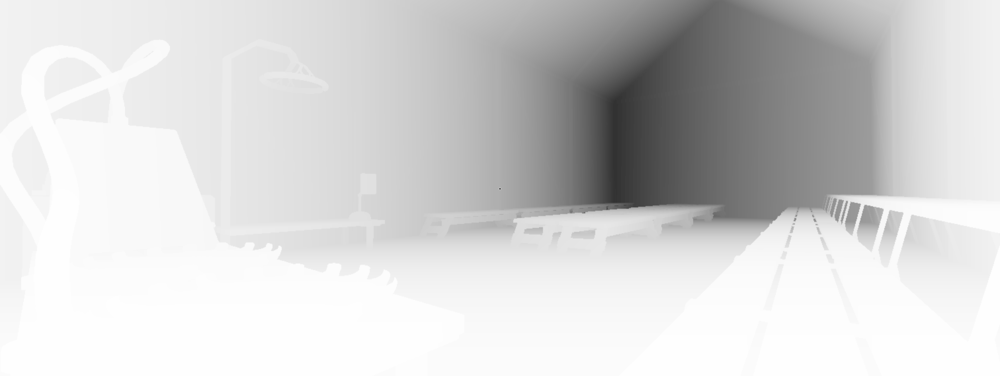

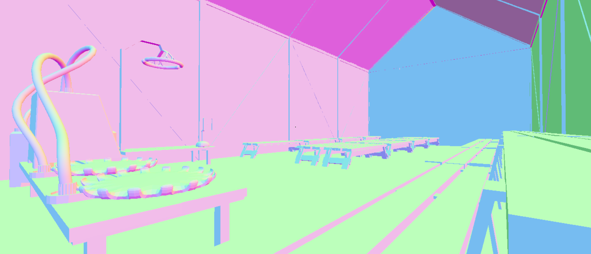

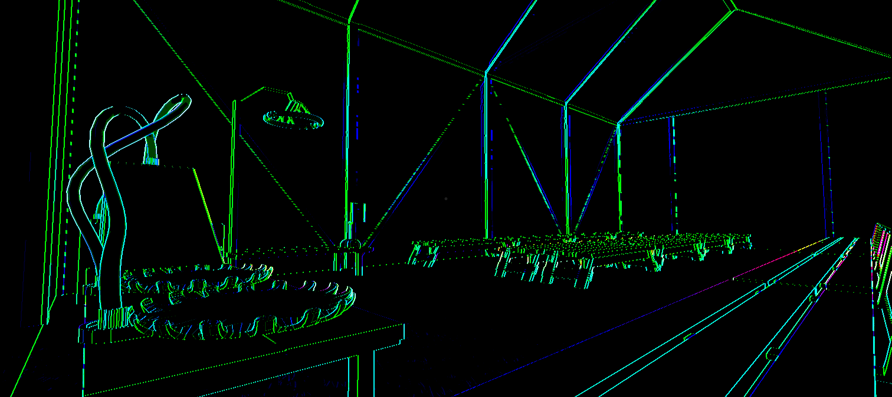

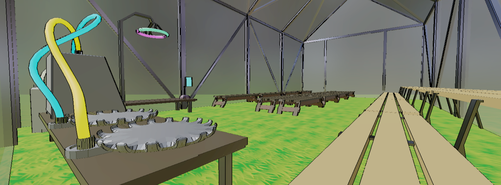

And the end result? Not that bad! In fact, it's very exciting if you are me! There still are some areas where the effect can be vastly improved, specifically in the anti-aliasing department, but I already have some awesome ideas about how I can implement those improvements. The only reason they (and everything else needed for MVP) aren't implemented yet is Google Chrome. Yep that's right, it was a web browser that was at the source of my frustration and delays for the last 3-4 days, because when you are developing for the web, the browser is the "compiler", and different browsers can run the same code just slightly differently. I had been developing this effect all week on Firefox where it was working perfectly fine, and then when I got to the stage that you see above I finally tested it on Chrome only to find that object depth detection was dipping in and out between being right and wrong randomly across the screen, this effected more than just the outlines, as depth information is needed for the entire rest of the render too. Disabling the post-processing pipeline altoghter and returning to the original shaderless method of rendering fixed the problem, but of course I didn't have any post-processing that I had worked on all week. Something in my post-processing pipeline had a bug, I just couldn't figure out where it was. Was it in the GLSL shader code that I had wrote? Was it happening while I was swapping render buffers back and forth? I just couldn't for the life of me figure out where the bug was coming from, until eventually after very extensive testing I figured out it had nothing to do with the code that I wrote, but is in fact a bug with Three.js render targets in Chrome, and perhaps has something to do with the way Chrome interprets WebGL alltoghter. At this point I've figured out that it's above my knowledge ability, and it's not really something I can fix. It is something that I have to at least remedy though, as Chrome is the most dominant web browser out there, I can't just not support it. The remedy that I've come up with for now is to raise the camera's "near" rendering threshold farther away from the camera. For some reason this helps the issue a lot, to the point where it's only present on very far away objects, but it is a comprimise because it means it is much easier for objects to get clipped by the camera being too close. Hopefully that won't be a problem after this upcoming week when I will implement a limit on where the player can walk, so they can't put themselves in object clipping positions as easily. And now that I've remedied the problem I can move on to actually implementing all the music algorithms and machine ehaviors and everything so that I will reach MVP really soon, before the end of this week, and then I can hopefully even have time to make even more visual shader improvements before this Friday too!

## Week 11: March 19 - 25
I'm only late on all accounts and predictions of my own, but this week I finally reached minimum viable product! While I had done a lot of ground work in previous weeks to make the job easier this week, such as object detection/highlighting and designing the "machines" themselves, there was still a lot of work to be done to bring it all together. The obvious machine to decide to start with was the genesis machine because creating a plant from scratch is practically the only way to *start* playing the game, and that's the job of the genesis machine. The genesis machine is likely going to be the only machine that brings up a unique menu of its own (separate from the usual pause menu), though there is still a chance that the future (not created yet) machine that exports and downloads the songs as MIDI files (which this might also become incorporated as a function of the interpreter machine) will also make use of its own separate unique menu. But now that I have more than one menu trying to interact with each other, and each asking for control over the web browser's pointer lock API at different times, things are getting complicated, and I am once again running into lovely inconsistencies between different web browsers. So Google Chrome will be able to exit out of the genesis machine's "import menu" immediately and automatically after uploading a file, and Firefox won't be able to. That's just going to be how it is. Also Google Chrome (at least on MacOS that is...) can only upload the same MIDI file from the normal uploading files dialogue once per session, but dragging and dropping works fine an infinite number of times. No idea why, but that's just going to have to be the way it be. And Firefox is totally fine with the file uploading compared to Chrome... I'm not even going to worry about other browsers for now like Safari cause fuck-em, who uses Safari anyways? I will probably go back and test (and try to fix issues) on Safari at the end of the semester if I have the time, but for now I think it's a better move to prioritize forward progress on development while still maintaining support and compatability for the only two browsers that actually matter.

Currently the genesis machine's import menu is really basic and I just quickly cobbled it together (pictured below), but this upcoming week I want to prioritize improving that menu a lot, including adding built in options that don't require uploading a MIDI file.

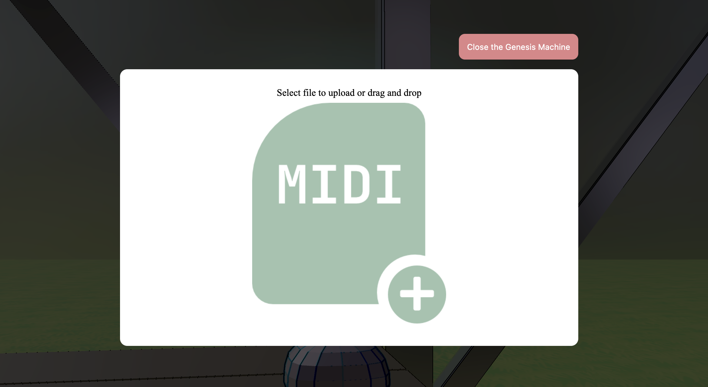

After getting the genesis machine working, I could really chose either the interpreter machine or the combinator machine to work on next; there was no clear gameplay mechanic loop that dictated one over the other. But I decided that from a development standpoint, it would be smarter to do the interpreter machine before the combinator machine, because even though the combinator machine is essentially the most core mechanic of the game, creating the interpreter machine first would allow me an easy in-game way to test the combinator machine that I had just created. Luckily for me, creating the interpreter machine was a lot easier than the combinator machine too (I hope to have the time to put a lot of effort into the interpreter machine in a week or too, but it's very basic for now). After implementing the basic funcionalities of the interpreter machine, and verifying that my genesis machine was also importing the MIDI files (mostly) correctly, it was finally time for me to move on to the most important part of the game: the combinator machine. Even though you are breeding two plants, I thought that breeding machine sounded too weird, so I changed the name some time ago to the combinator machine. Implementing the combinator machine first required me to implement the ability to click (and hold) and drag a lever object in the game, because that's an important input to the combinator machine. Then once I had my player input upgraded, I was able to essentially copy and paste the "breeding algorithm" (which is what I used to call it) from my multiple previous prototypes of this idea that I had created in semesters past. The algorithm needed a bit of adjusting and fine tuning to fully fit into the context and structure of the current project, but it wasn't too bad in the end. And then the final thing I had to work on before combinator machine was roughly complete was getting rid of any old plants on the workbenches (while saving the ones on the showbenches). One intricacy of getting rid of the old workbench plants is that I needed to make sure all of the extra geometries and materials were properly disposed of, otherwise performance would take a huge hit over successive generations due to a big memory leak. Getting that disposal right was actually a bit tricky, but I think I eventually did, and then I also implemented a pause feature that actually pauses the rendering while in the pause menu, so overall the performance isn't half bad! Below is a picture of the greenhouse full of some children (of the parents that you can still see on the combinator machine in the back).

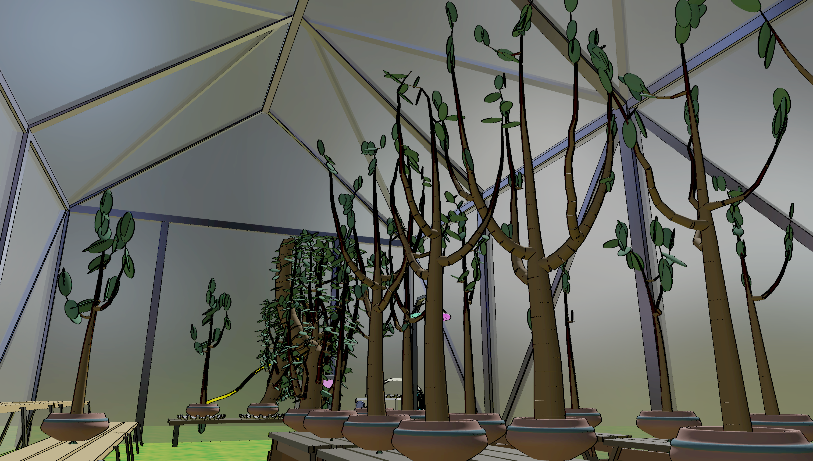

Other than the goals for next week that I've already mentioned, I want to improve the main pause menu to be like a users manual (this would also serve as a tuturial for new players), and I want to improve the performance even further through plant geometry optimizations, and finally I want to improve the visuals by adding thicker outlines in some places (and thinner outlines in other places) as well as antialiasing and even some toon shading. And finally there is a big performance issue right now while the combinator machine is chugging away. There are a lot of network requests that need to be made back and forth to Magenta's main servers (probably somewhere on Google Cloud), and the process of running the combinator machine takes up to a minute or even more. I thought that running that code in an asynchronous function would be good enuogh for performance reasons, but it still seems to interupt the main thread every second (or even more), which provides for a pretty unacceptable playing experience. So my plan to fix that issue is to use a Web Worker to really separate out the processes and hopefully smooth out performance while the combinator machine is chugging away.

## Week 12: March 26 - April 1
I don't expect this process log to contain any pictures, it'll just be a long little rant from me, because this past week kind of defeated me in terms of goals vs accomplishments, though I guess I did learn a shit ton from this week. Right off the bat, the first thing I thought I'd do from my goals last process update was to move all of the Magenta MusicVAE logic to a web worker so that it was properly running on its own thread. But after working on that for more than a day and a half, I discovered that the Magenta.js library tries to instantiate the offline audio context at import time, even if I'm not using any parts of the library that are actually using the offline audio context. That would be fine all except for that the offline audio context doesn't exist in a web worker thread... only a normal thread. So after a day and a half of straight work on web workers I had to pivot to something else.

My first instinct for that something else was that the Magenta library is offered in two flavors: Python and JS. I had been using the JS library this whole time, but I could totally replicate that logic in Python with the Python version of the library. The harder part would be getting the music stuff writen in Python to communicate with the rest of the JS application that I've been creating this whole time. The obvious option would be to create and host a Python server on either an old computer I have laying around or probably more realisticaly on a virtual machine that I rent out from some large server company like Linode for a decent (not tremendous, but not insignificant) monthly charge. And I thought I might go with this option for a while, even researching how I would go about coding and creating the server side boiler plate logic in Python, but I eventually got overwhelmed thinking about doing something entirely new to me, creating a Python server, in the last few weeks of a project in a desperate attempt to save the performance.

That's when I rememebered that Vercel, the platform that I set up my front-end continuous deployment situation on (back in week 9), has a "Serverless Functions" feature. It basically allows me to write just the python code that is recieving the specific request and returning the specific response, and they handle all the rest of the server logic that I was really worried about: ports, request and response forwarding, continuous run-cycling, etc. I was really excited when I remembered this feature, I thought for sure it would be my solution, all I had to do was include basic python code in my repository, and my continuous-deployment vendor would handle the rest! It would cost me a similar (unfortunately not insignificant) amount per month, because the serverless functions feature is locked behind Vercel's "pro" plan (I've been using their free "hobby" plan up until now), but I think it would be worth it to me given all the other perks I would get with the pro plan on Vercel. I would even be able to use these serverless functions to improve my personal website which I am also using Vercel for deployment there.

I figured before I purchased this pro plan, I should try just writing these Python functions to make sure I could get my logic to transfer from JS to Python properly. And the answer was: I couldn't even get the Magenta Python library to install, even after a *lot* of wasted time trying. The developers seemingly haven't updated the library in quite some time. It's not like Magenta is a totally dead project or anything, but their dependencies are frustratingly out of date, and the code relies on old versions of old packages that fundamentally need to be compiled in an old version of the C compiler which was never intended to run on an ARM processor, making x86 absolutely required in order to use Magenta as a Python library. Which is really a shame, because a lot of people out there, including myself, have bought a new computer from Apple in the last 2 years, which means our processors are ARM architecture, and Magenta as a Python library is off limits to us.

"That's okay," I thought, "I guess I can just fire up my old desktop computer that has an x86 processor and install the library on there." Which I once again spent *way* too much time trying to do. Not only did I have to do the (feels very) dangerous task of downgrading my entire C compiler 6 versions on my computer, but I eventually discovered that I also needed to downgrade my Python version to 3.7, which felt and was much easier and less dangerous than the C compiler. Once I got it all working I checked back in on the Vercel serverless functions documentation only to find out that they only support running code in Python versions 3.6 and 3.9, and they were dropping support for 3.6 (which probably would work for me) very soon, leaving only 3.9, which won't work because the Magenta library is frustratingly out of date. Not to mention I felt worried about the prospect of even getting the library installed on Vercel's servers in the first place, given the whole extremeley out of date C compiler that is needed and such. So at that point, I figured serverless functions were off the table. A seperate server on a separate host running these Python Magenta functions could still work out given the right circumstances, but it would still be extremely hard, and I'm honestly not really sure I have enough time left in this project.

Luckily I didn't have to start looking into creating my own separate server again because I had already reached close to the end of the week, just one more day left, and it was time to meet with my advisor. Matt suggested to me to keep the non-performant version, but lock the player away from being able to experience the non-performance with a loading screen. He convinced me that nobody would question the thought that some hard core computing just had to take place if the loading screen completes and they turn around to see a greenhouse full of brand new plants. They would still love the experience (close enough to) as much as if they got to run around the greenhouse while the computations are taking place. So after that meeting I implemented a static loading screen that locks the player away from being able to interact with the game while the laggy stuff is happening, and it was a pretty great solution! It didn't take me that long at all, and I could finally let the issue off my mind... right?

Even though the issue was "solved" I still really want the player to be able to run around the greenhouse while the combination is happening. It just doesn't feel right to interrupt the gameplay flow for *that long* like that. So my brain kept on coming up with other ways that I could separate out the plantsong combination logic and make it more performant for the user. And the most promising idea that came to mind was SvelteKit. SvelteKit is a web development application framework similar to Next.js (built uppon React) and Nuxt.js (built uppon Vue). There are several differences between say Next.js and React, or SvelteKit and Svelte, that make them full application frameworks instead of just component frameworks, but the most important one to me right now is the ability to run pseudo-backend code on the "edge" (on the browser itself). And the best part is that this pseudo-backend code is written just like frontend code, making it incredibly easy for frontend developers to write. I already have experience with SvelteKit, as I use it for my personal website, so my thought was if I could get Magenta.js to work in a SvelteKit pseudo-backend then I would have the experience and know how to convert the rest of my game to a SvelteKit application, which would actually be pretty cool to have solidity of a good framework holding up my application. I spent almost the entire rest of my development time this week creating a prototype that would prove (or disprove) the concept of using Magenta.js in SvelteKit backend, and unfortunately that time yielded the result that no, it would not work at all (Magenta was trying to do some actions that SvelteKit determined illegal on the backend, only legal on the frontend). But fortunately for me that time did yield one golden nugget of information that lead me to try one last thing, that still isn't quite there yet, but so much closer to being there, and the golden nugget just keeps on giving after that, I have an idea that I'm pretty sure now will 100% work and not be too much work for me to complete at all.

I'll get to that 100% idea in a second, but first that golden nugget? [This pull request](https://github.com/magenta/magenta-js/pull/337) in the Magenta.js library outlining how the library can infact be used without an audio context! And since that was the problem that was keeping me from moving forward with web workers, I was able to switch back over to that branch and actually get the web workers web working! There was a couple of issues with the actually working web workers. One of them was that in Firefox the web worker version of the code was running about 500 times slower (not even an exaggeration) than the normal single-threaded code, meaning it would take literal hours for a single combine to happen, something that I want the player to do *a lot*, not just once every few hours, it's the core gameplay interaciton loop. The other big issue was with Chrome instead of Firefox: despite being it's entirely own separate thread, Chrome was still letting the excessive event loop overloading, that was the core source of this performance issue to begin with, interrupt the main thread, meaning the web worker makes absolutely no difference in Chrome. So... web workers were off the table for the second time, but I mentioned that right before development ended that the golden nugget of a pull request gave me one last idea that I'm *very* confident will work. And that idea is to return to serverless functions for the second time! I originally dismissed the node.js section of Vercel's serverless functions documentation the first time, because I assumed it wouldn't work due to the same audio context error with web workers. But that golden nugget pull request also explains how the same thing can be done to fix the library working in a node.js context, so I could totally code this all in JS, and use Vercel's serverless functions, and I don't have to deal with any of the Python issues of versions and out-of-date-ness at all! So that's definitely going to be the first thing I try next week, and hopefully then I will finally be able to put my mind to rest and consider the problem "solved".

## Week 13: April 2 - 8
If you are following along with the timeline that I layed out in the scope of work document at the beginning of the semester, then you'd see that anything I really do for development from here on out, starting this upcoming week, should really just fall under the "final tweaks" category, and my main focus from here on out should be pivoting towards the video and the final grad program reflection paper. Because of that timeline, for the last half of the semester, I've been pretty much treating April 8 as a sort of 100% deadline. Not really like a "100%" kind of 100%, but more like a "if I *absolutely* had to ship this right now, I actually could, and my inner perfectionist would only scream a little" kind of 100%. And I'm proud to say that I made it to that deadline! I'm not writing this process log until a little later than usual because I had a really hard push near the end to make that personal deadline, so I took the whole weekend off to rest. But I'd love to talk you through how I reached that kind-of sort-of 100% mark by the end of this previous week of development.

It all started with the serverless functions on Vercel's platform. In the last process log I ended with my plan to use Magenta in a node.js environment and serve the function calls like an API. The first thing I did this week was sign up for a 14 day free trial of Verel "Pro" and migrate my project over to there. Luckily I'm getting pretty good at setting up and migrating projects around Vercel by now, so this wasn't to challanging. And then I started working on writing my old "breeding" algorithm as a serverless function. I eventually got there, but it took me more than 3 days, and it was an infuriating process the entire way. I'm not sure why I didn't give up earlier, but I think it's because it always just felt so much closer than it actually was. The main and most frustrating problem that I was running in to was that serverless functions would work just fine until I tried deploying with a serverless function that was less than fine. If that happened then every single serverless function would break, including the ones that were previously working. And ammending the bad file to be good, or even getting rid of the bad file altoghther so that I shouldn't cause any issues, wouldn't fix any of the previous serverless functions. Even though 100% of the code that was being deployed theoretically should have been working, it wasn't. I eventually found a solution to it, which was to completely delete the "project" from Vercel's end all together, and create a brand new project to re-deploy it (my code wasn't lost, because it was still on GitLab, my Vercel project was just "pointing" to my GitLab code). After doing this a million times, I ended up getting really good at it, but it was also really really annoying. And finally, when I got the perfect function up there and deployed, it would take too long to execute, and even after slimming it down as much as I could, I would butt up against Vercel's 60 seccond time limit more often than not, leading to an inconsistent experience that just wouldn't do. So I finally decided to delete my Vercel "Pro" trial before they ever charged me anything, and go back to my "Hobby" level account.

I was giving up on serverless functions from Vercel, but I wasn't quite ready to give up on serverless functions (sometimes referred to as "functions as a service") just yet. Throughout my searching for fixes to my Vercel problems, I came accross hints that they might not be doing much of the serverless functions themselves, but rather building uppon AWS's "lamda" functions as a service. Throughout my internship at Lingoport I've become decently well acquainted with the various cloud platforms, AWS, Google Cloud, and Azure, and I knew that every one of those cloud platform suites had their own version of functions as a service. I decided to try starting with Google, for literally no reason at all, might as well have pulled a name out of a hat. Though from my experience, both AWS and Google were much easier to work with than Microsoft, so realistically it came down to a mental coin flip between AWS and Google. I figured if the first one I tried didn't work out, I could always move on to another one. Luckily for me, the first one, Google, did work out, and very quickly too! Within an afternoon I was able to set up a new account, create a new function-as-a-service endpoint, and upload the exact same node.js code that I had been working all week on to the Google Cloud servers, and bada-bing bada-boom (sp?), my serverless functions were working! And as an added benefit, they are running much faster than they did on Vercel, and because I'm just paying for only the amount that the function gets used, instead of a flat fee per month, it will likely be so much cheaper for me in the long run than Vercel Pro would be.

Overall I'm very pleased with where I ended up after all that work on the "serverless functions"/"functions as a service" and overall the work I had put in to the game over the last two whole weeks to improve performance. But by the time I was done with that I had less than 72 hours until my personal deadline. So it was crunch time for me to be finishing everything up. The first thing I wanted to do was to continue improving the performance of the game while also making it look better, and I did that in two ways. The bigger and more challanging improvement to combined visuals and performance was to get rid of the hundreds of individual cylinder geometries that made up each plant, and replace them with one smooth branching tube-like geometry per plant. This would not only make the plant trunks and branches look smoother, but it would reduce the number of geometries in the scene by multiple orders of magnitude, which would be great for performance. I probably wasted too much time on this feature, but I really wanted the benefits and improvements that I was expecting out of it. The easier way that I improved my performance and my visuals was with a change to the outline shader that I'm using twice, once to stylize the scene, and again to draw highlights on certain objects when they are hovered over. I have been wanting to improve the look of that shader ever since I created it, but never could justify the time spent on it. But now I wanted it to help me render pictures of the various machines that look hand-drawn, which I want to use in the "Owner's Manual" which I'll get to in a few paragraphs, and I felt like it was worth the time (spoiler alert: it wasn't but I'm still kind of glad I did it anyways). So now after these two visual and performance improvements, the game and the plants looked pretty nice!

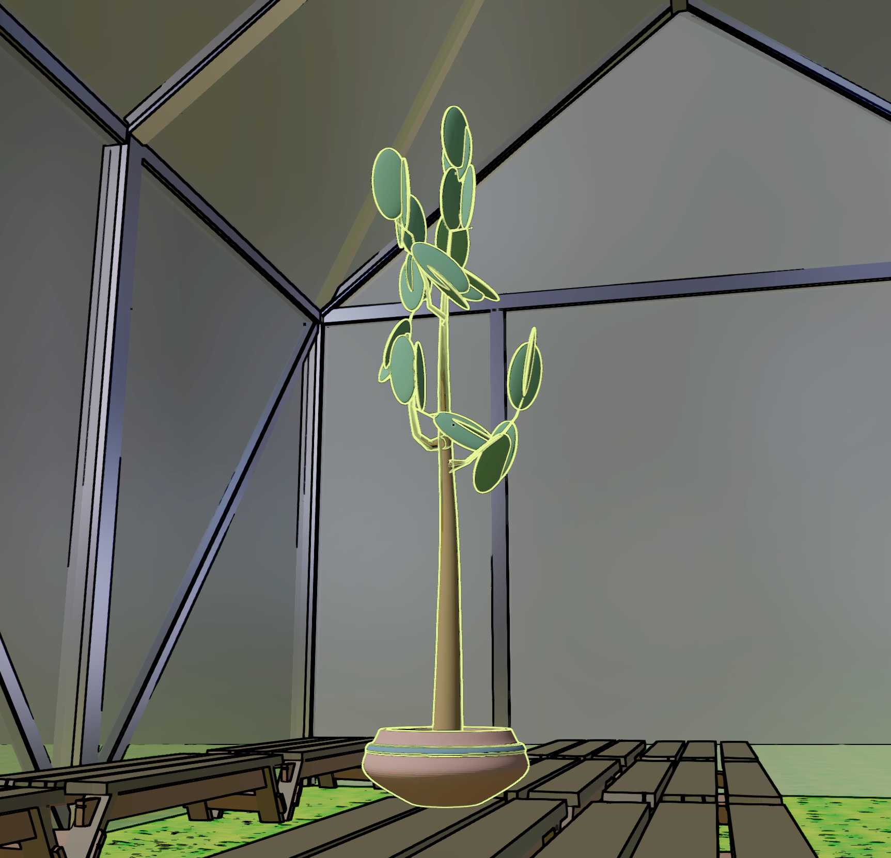

Once I had made those two improvements, I had three (kinda four) more features that I felt were pretty important to add before the "basically 100%" deadline: 1. improve the UX of the combinator machine with an extra button and some animations, 2. add a download button to the interpreter machine, and 3. add and "Owner's Manual" that can guide new players through how to use their fancy new Beat Greenhouse. The first feature was kind of two features, but was also the easiest to add, because most of it was just making improvements to the model in Blender. There was not much code I had to add to incorporate the button, or some (very basic) animations, and all of that code was code that I already knew how to write, so that went nice and quick. The second feature to add was pretty similar, because it started out with some fun improvements to the interpreter machine in Blender, but then when it came to add code, it was no longer quick and easy code that I already knew how to write. I somehow figured it out pretty quickly, but the downloads were for some reason just not right... but at this point, I was running out of time, and had less than 3 hours until my personal deadline, so I just had to roll with it. The MIDI that gets downloaded is *not* the same as the MIDI that gets played outloud natively in the application by the interpreter machine, but oh well. And finally with just an hour and a half left, I had an entire "Owner's Manual" to create. Luckily for me, I set up a system for the Owner's Manual earlier in the week, and so I really just had to fill that system up with content. But still, there was a lot about this game to explain, and it's hard to write things well enough to get large messages accross in a few amount of words. So I tried my hardest, but it still took me the whole hour and a half to write the words I needed to write (and they still probably need some heavy editing next week...), so I didn't have time to render any fun "hand-drawn" looking pictures to add to the Owner's Manual. In fact I didn't have time to make the Owner's Manual look even remotely pretty at all, because I finished up writing right at 11:58pm. But I barely got it in, and so now strangers who happen uppon my game won't be 100% confused, and I'm proud of that. And that's the game in its "pretty much 100%" state! There's still a *lot* of polish that I want to do to the game, but like I said, I wouldn't be very embarassed or my inner perfectionist wont get too angry if I absolutely had to ship the game right now. So everything I do this coming week and out will just be "finishing touches" only, which feels pretty good!

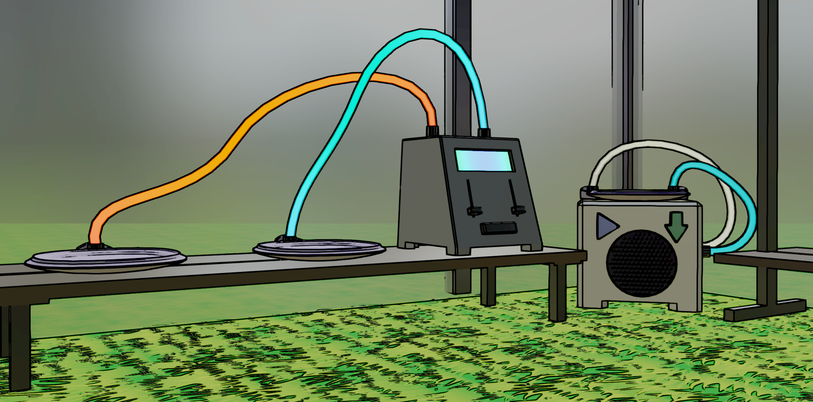

## Week 14: April 9 - 15
This week I got to mainly just focus on finishing touches, and so I made quite a few fun and nice finishing touches! The first thing I worked on was trying to improve the look of the grass. When I first added the grass back in week 8, I was thinking (hoping) that the texture for the grass would just be temporary, yet it managed to stick around all the way through my "pretty much 100%" day last week. Now that I am passed that 100% mark, I finally have the time to go back and make the grass look better like I originally wanted. My design goal with the grass was to have a solid color as a base, and then to give it texture using the outlines of the outline shader that I have worked on in previous weeks. I started out by trying to create litle grass clumps in Blender, but I still have a lot of learning to do in Blender before I'm a pro, and my attempts at grass clumps were very very ugly. So after failing to make grass clumps in Blender a few times, I changed plans, and tried creating a 2D displacement map that I'd use to displace vertices of a plane to create 3D grass. But after a day of messing around with displacement maps, I still wasn't satisfied with how it looked, so it was time to try something else to improve the look of the grass. It took me another day or two of working on something else to even think of that next idea, but eventually I decided that I would continue using the grass texture that I created (found and modified) in week 8, but in a new way. Instead of always showing the texture, I would show a solid color like I wanted, but then during the postprocessing process where I detect the edges and draw the outlines, temporarily switch over to using the texture rather than a solid color. That way the grass texture could be seen slightly through the outlines, but still overall it was a better cartoony flat look with the solid color base behind the outlines.

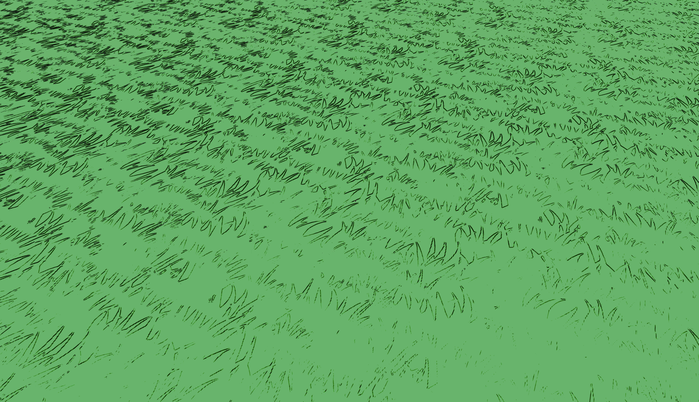

The next "final touches" improvement that I made this week was to fix the tempo that songs would play back at. This ultimately just involved one change to the importing of songs process, were the MIDI needed to be quantized at 4 steps per quarter instead of the 2 steps per quarter as I had originally coded it. After the tempo was fixed, I improved the look of the owner's manual a bit by including a font in the project, and taking pictures of all the machines and benches so that the owner's manual could have some pictures to help it out. Then after that I added color variation to the plant parameters, so that plants could be different colors instead of all being the same colors. And then as I was adding the color variation, I also did a lot of work to fine-tune and adjust how those parameters were retrieved from the latent space encoding. It took a lot of effort, but now the plants look like 15 times better than they did last week, so I'm very excited about that!

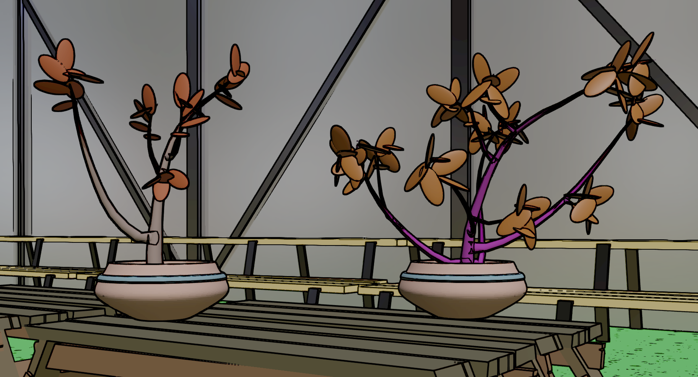

I feel like the final touches that I added this week improved the game overall a bunch, and I'm so much happier with where the game is now compared to last week, when I "should've been 100%" so that's great. There's still a few final touches that I'd love to incorporate next week, but now the video is a higher priority, and so I'm going to try to get a good rough draft of that done before I continue tweaking the game (first by improving the leaf look and variaton, and then after that doing the same to the pots).
