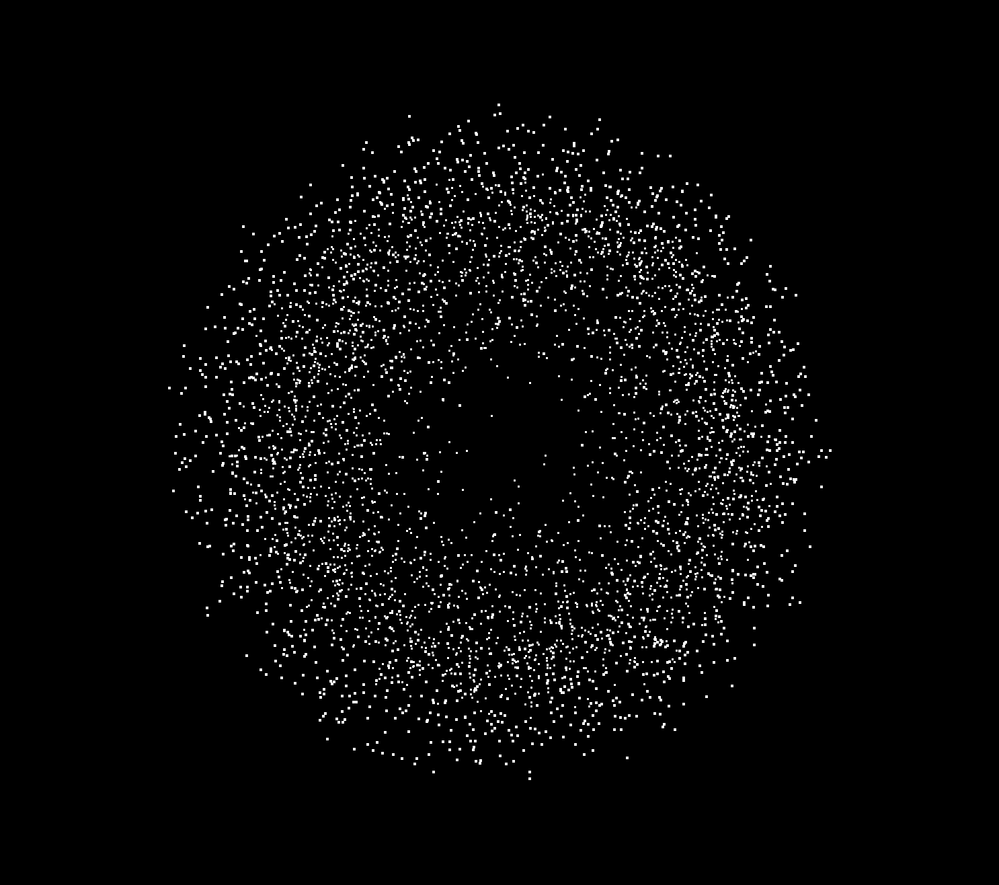
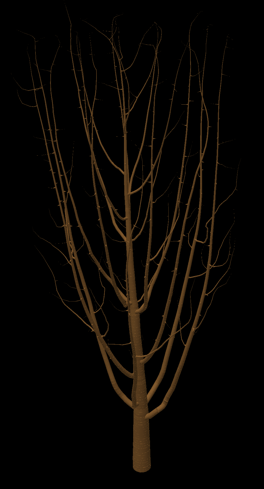
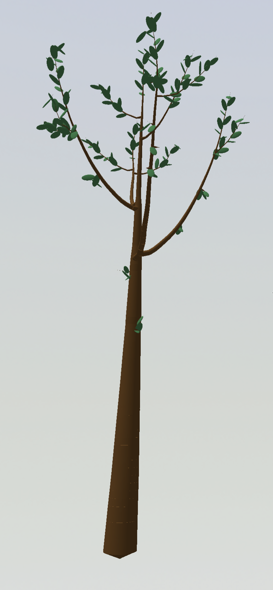
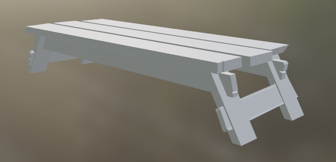
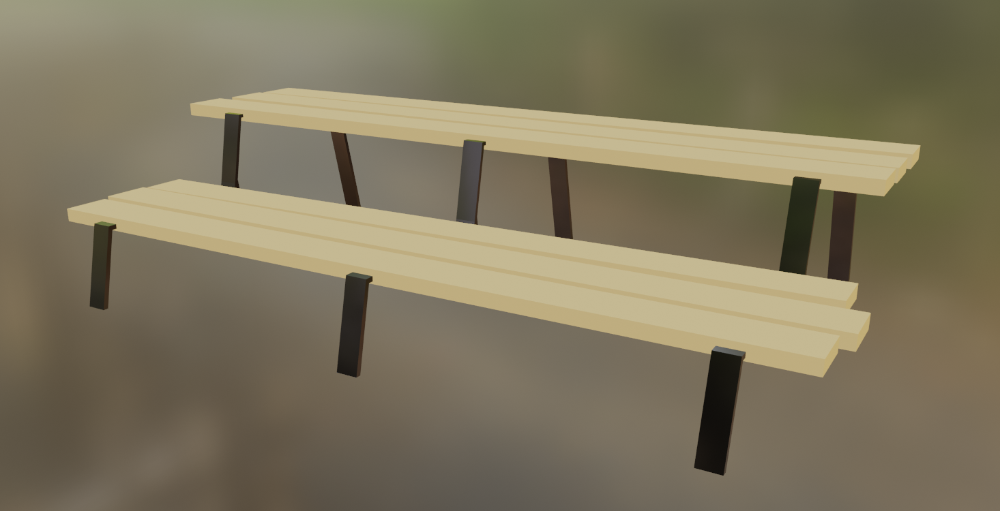
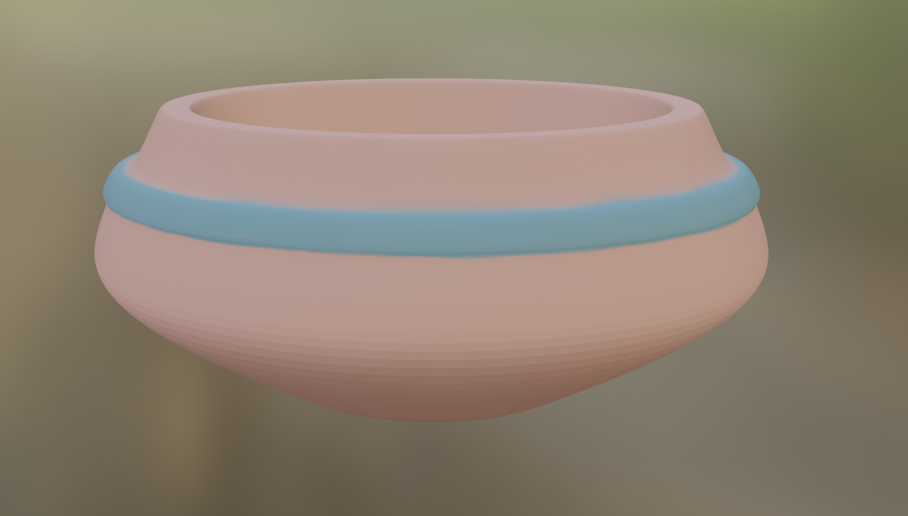
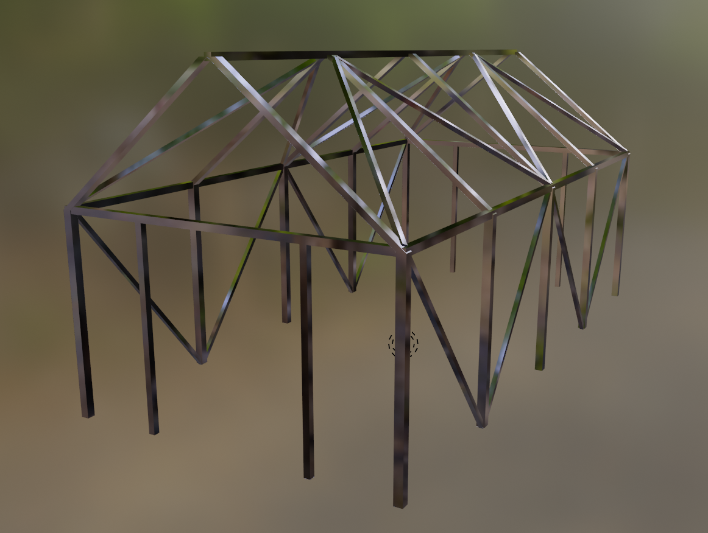
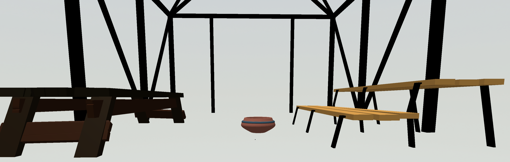
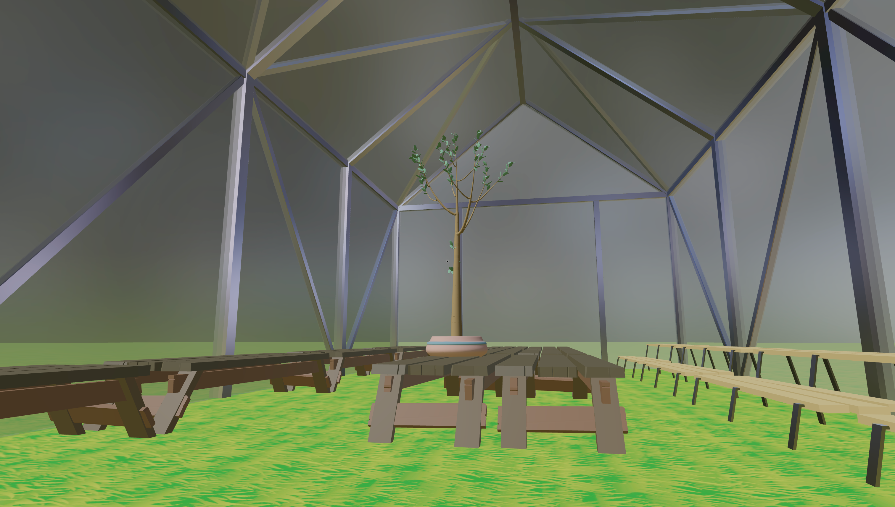

# Weekly Process Logs
## Week 1: January 10 - 14
The [Scope of Work](scope-of-work/README.md) document was created and signed this week.

## Week 2: January 15 - 21
Week 2 was the first real week of work on this project, as the first week was dedicated to administrative activities like planning. These administrative things are still very important though, and even this week was split between beginning development and still planning for the future.

This week when meeting with my advisor, we mostly discussed my scope of work document that I created last week. Matt also brought up a different kind of planning document that I could work on in addition to my timeline that I included in the scope of work. This second document is more of a requirements based spreadsheet, but much more detailed, and is focused on the overall user experience of the game from start-up to shut-down. I got a start on this document this week, but haven't made too much progress on it yet as I just met with Matt yesterday. My scope of work document made it clear that I still am not 100% committed on what the *exact* user experience I am developing, though I have a very good understanding of the feelings I want to convey and the overall broader shape and form of the deliverable. But I only outlined that in 4 broad and vague "objectives" bullet points, and I'm looking forward to working on this document so I can 100% understand myself what exactly it is that I am creating this semester. I haven't included that document in this repository yet because I'm not done with it, but next week's process log will certainly have a link to it.

As far as development progress goes, my general timeline layed out in the scope of work document says that this I am starting from scratch on a new generative plant algorithm. And that I am! I started out by reading several papers from the Biological Modeling and Visualization research group out of University of Calgary. I first discovered their website http://algorithmicbotany.org/ about a year ago when I was looking for some project ideas and inspiration while I was taking a course on biological modeling. They have done multiple papers outlining various different methods for computational models of plant and tree structures, and I hope that if I can't combine them all (or even just some of them) into my own personalized algorithm, I hope I can at least implement my favorite algorithm of them all. I have already gotten a start working on building up a space colonization algorithm based on the procedure outlined in [Modeling Trees with a Space Colonization Algorithm](http://algorithmicbotany.org/papers/colonization.egwnp2007.large.pdf) by Adam Runions et al. I chose to start with that algorithm as a base, and modify things from there, because it's the most interesting and enticing approach that I've read so far. But I hope to read even more papers, and hopefully include insights from them in my development process too. I've already read many great ideas that I'd like to look into including in the future, such as [L-systems](http://algorithmicbotany.org/papers/modeling-plant-development-with-l-systems.pdf), and [structural analysis](http://algorithmicbotany.org/papers/quantifying-the-degree-of-self-nestedness.pdf). But I can't include those ideas yet, because so far I have pretty much nothing. I have a solid-ish start on the space colonization algorithm, but only through numbers based debugging and testing, I have nothing exciting or visual to show in a process log. Next week there will be some very fun screenshots though, as I will have a much more solid algorithm in my hands by that time! And for now, I consider even my research to be enough progress, so I'm glad to have gotten a bit of a head start on the coding as well.

## Week 3: January 22 - January 28
Admittedly I am writing this process blog post on Saturday instead of Friday like I had intendid. So technically I am late on this one. But it's really fine because in effect, the weekly process post is just supposed to separate the work I've accoplished by the end of the day on Friday of one week from the work I will accoplish starting Saturday of the next week. And since I am writing this Saturday before I get anything else done on this project, I think it's still okay.

This week I accomplished a lot! And yet still I didn't quite accomplish everything I sought out to do or mentioned in my process log last week. Last week I mentioned I would be working primarily on 2 things this week: the new planning document, which I am calling "UX Macro Requirements," and the tree generation algorithm itself.

As for the UX Macro Requirements document, I last week said that I would have the document finished (at least to a good first draft state) and uploaded, but while working on the document, I realized it would actually turn out to be a much bigger, and much more important document than I initially thought it would be. I also realized that I would need to know more about what the final product I am creating actually is, before I can really get a good foundation going in the UX Macro Requirements document. So I'm deciding to upload the document in its work in progress state right now with this process post, but not link to it yet until next week when I have it much more filled out.

I did start to plan out how I might want the user interface to look, specifically how the user would change the various settings that control how the plants/music are bred together. In my Scope of Work document, which pretty much acted as a project proposal, I mentioned that I had pretty much two options for a lot of the actions I want the user to perform. One of the options, which may (or may not?) be the easiest option, is to include everything in a simple 2D UI/menu that pops up when the user presses the escape key. Another option which I think would be the most fun, but possibly a lot harder, is to include as many of these settings as 3D in-world sliders and knobs. There is also a third option, which is kind of a hybrid between the first two, where the separate menus are tied to separate and distinct objects/locations within the greenhouse, but the menus themselves are still standard 2D interfaces. That third option is probably the most likely because of the balance it strikes between conventional and unconventional. And I know that even if I mostly go for the second option, there still is going to be the occasional setting/action that has to be tied to a more standard menu, and for those cases, I'd fall back to the hybrid option. But for now I've just drawn a mockup UI for the very first option to help guide my UX Macro Reqirements doc. That mockup is featured below! Early next week, I plan on drawing a mockup for the second option as well, and possibly even the third.

As for the other task I had hoped to accomplish this week, I think I accomplished it beautifully. I had already made just a little bit of progress implementing the space colonization from Adam Runions et al., and all I had to do was make enough more progress implementing that algorithm that I had screenshots to share. And oh boy do I have screenshots to share!

The first step of the algorithm is to generate a set of "attraction points" that lie within a specified shape (the paper refers to this shape as the "envelope" so that's what I will call it from here on out too). I knew that a having customizable size, shape, and relative position of the envelope would be important to generating many various different plants (and using up as many dimensions of the MusicVAE's 256 dimensional latent space as possible), but the customizable shape part of that would pose at least a non-zero challange. So I just skipped right past that step, and generated a uniformly distributed random set of points inside a cube, because that's one of the easiest and quickest random sets of points to generate. However, two more of my goals for next week (in addition to the UX planning goals) are to add customizability to not only the shape of the envelope, probably through a solid of revolution method because that is what is mentioned in the paper, but also to the distribution of points within the envelope, because a uniform distribution is nice for some plants, but it would also be cool to create even more unique plants based off of a distribution that is skewed towards the outside of the envelope or the inside or even somewhere in between.

After the attraction points are generated, the first "node" of the stems/branches of the plant can be placed at the designated starting point (relative to the envelope), and then the successive nodes can be iteratively added to generate the plant. Each iteration contains 5-6ish steps to add nodes. First, every single attractor searches for nodes within a certain attraction radius of themselves. If there are node(s) close enough, then the closest node gets a list (if it doesn't exist already) of attractors that are affecting that node only, and that particular attractor is added to the list. Then for each node that has a list with 1 or more attractors affecting it, the direction from the node to each affecting attractor is averaged, and then a new node is added to the tree a specfied "growth speed" distance away in that direction. Then finally, once a node has reached an attractor point within a certain "kill distance" (which must be less than the attraction radius in order to sustain growth), the attractor point is removed from the overall set of attractors so that it is no longer affecting the rest of the plant's growth. To mess around with the parameters and find the best viable ranges for plants to be generated in, I created a simple GUI with sliders using a package meant for creative coding applications like this called lil-gui. And with this algorithm as it is, I've been able to create some pretty amazing plants, even without the envelope shaping and distributing that I will be incorporating next week!

## Week 4: January 29 - February 4
Similar to the week before, I had 2 major kinds of goals this past week. Some related to the overall planning of the project, more specifically the UX Macro Requirements document, and some goals related to actual development on the project itself. For the monster of a document that the UX Macro Requirements is turning into, I had a goal of getting a good solid first draft done by now, knowing that it is likely going to change througout the course of this project. It turned out to be *way* more work than I had anticipated, even though I already got a taste at how difficult this document was weeks prior. But I did indeed finish off a pretty good solid first draft of the document. The downside of it being such an in-detail document is that in order to write this process log on time instead of a day late like last week, I had to pretty much leave out 2 sections out of 6. But the upside of completing the most important 4 out of 6 sections is that I have *so so so so so so so* much better of an idea of what I'm doing with this plantsong breeding algorithm than I did before! Oh yeah, and that's another thing that the document helped me with: I came up with the name "plantsong" for the things the player is working with. They're both plants and songs! I'm not sure if the name is actually here to stay, but I like it for now.

It may just be a first draft, and maybe not *technically* complete, but it's still pretty damn full, so here's a link to the [UX Macro Requirements](ux-macro-requirements/README.md) document.

The second category of goals that I set for myself to complete this last week relate to the generative plant algorithm that I've been working on (inspired by the space colonization alogrithm from Adam Runions et al. of Algorithmic Botany, see previous process logs for links). For the plant generation algorithm I had hoped to do two things: add control over the shape of the envelope in which the attraction points were randomly generated, and also add control over the "random" distribution of the points within the envelope. Unfortunately I only had time to implement the first goal, controlling the shape of the envelope, and the second goal needs to be prolonged until first thing next week. But controlling the shape of the envelope was also a bit more challanging than I expected, and it's big news too! It means not only that we will make use of more of the 256 inputs that we will be offered into this plant generation algorithm, but also that the plants structures just look way more natrual, round, and variable. Take a look at one of the plants generated now with envelope shape control (as well as the temporary "debug" mesh showing the actual shape of the envelope):

Another thing I wanted to spend some time doing in the code this week, and got to, but didn't call out last week, was organize the code a little bit as well as organize the temporary "controls" panel that you can see off to the right side in the screenshot. That was really a minor side-track, and didn't really take away from the "random distribution control" that I didn't get to accomplishing this past week because that will be a pretty major task. In my Scope of Work document, I mention around one of these weeks that I want to look into making all of the randomness in this plant algorithm deterministic using a noise algorithm instead. I would take this on at the same time as controlling the distribution, because it kind of needs to be, and that's part of what makes it such a large task, and why I need to procrastinate it until next week. Incorporating this determinism and noise function behaviour is incredibly important though, because it will mean that very similar latent space vectors will end up generating very similar plants. In the end what that means is that parents and children and all their siblings will be much more likely to look like each other than plantsongs of different "genetics."

The fact that I didn't finish it this past week, and the fact that it's so important to the outcome of the project overall, means that accomplishing the plant (deterministic) random distribution is my number 1 goal for next week. But I also have some more goals, because February just started, which means we're coming up on the end of "early" development, and I need to start working on "mid-early" and even "mid" development tasks very very soon. So I really need to visualize these trunks and branches with cylinders of appropriate sizes this week too. And if I can, I'd like to also create some leaves, and plant accessories such as flowers and fruits, and as much variation amongst those as possible as well. It's kind of crunch time if I could get all of that done, but I almost feel like an "end of early-dev crunch/sprint" is a little bit necessary to jump-start this project back into gear again at this point.

## Week 5: February 5 - 11
Similar to two weeks ago, I'm *technically* writing this entry a day late, but also because I didn't make any progress this weekend, the actual date that I write this process log *effectively* doesn't matter. I hoped to really make a lot of progress last week, so that I could officially end "early development," which consisted of creating the plants themselves, and move on to "early-mid" and "mid development," which will consist of putting the plants inside the greenhouse itself. While I didn't make as much progress as I had hoped, and I will need to spend just a half week more in "early development," I still made a lot of progress this week that I'm pretty proud of.

My first accomplishment this week was to improve my control over the random attractor points that are at the core of the space colonization algorithm.I started out by making these random points not random at all, but just seem that way. The simplest way for me to make things look random but actually be deterministic would be for me to just set a random seed, and then proceed on my merry way with regular "randomness" that is determined by the seed. But if I had done it that way, then the set of attractor points from one plant compared to another would be equally as different regardless of how similar the "genetics" (the MVAE latent space vector is the genetics) of the two plants are. I wanted not only determinism, but also scaling similarity. In order to accomplish both at the same time, I used simplex noise, where if the noise value is above a certain threshold at a sample point, then an attractor point is created there. Values such as the threshold, sampling frequency, and sampling offset in each of the three dimensions, can all then be controlled by the plant's genetics. That way, plants with similar genetics will have attractor points in very similar locations, and they will have even more similar structures than if I hadn't implemented scaling similarity alongside deterministic attractor point placement. After I had successfully implemented the determinism, the next part of controlling the attractor points was to control whether they are distributed evenly throughout the envelope, or if there are more attractor points at the center or edges of the envelope. Implementing the determinism the way I did (through noise) actually helped make implementing this distribution control a lot easier, because all I had to do was scale the threshold value based on the radius of the point in cylindrical coordinates. The picture below shows a set of attractor points that was generated with the distribution controlled such that the points are all close to the edge of the envelope, and there are practically no points that are generated near the center.

After implementing a brand new method (and in my opinion very cool method) to control the distribution of the random attractor points, my next goal for this week was to start visualizing the trunks and branches of the trees with cylinders and cones that are scaled to the right size in order to make it look like an actual plant/tree. I based my method on the one outlined in the paper that I based the original space colonization algorithm on. The authors didn't describe it in too much detail, but the mentioned that they started at the tip of every branch and work towards the root node at the base of the tree, slowly increasing the radius of the cylinders as we move farther and farther down the tree, and wherever two branches meet, the resulting singular branch has a radius that is a combination of the two branches that met. Before I could implement any such methods to determine the branch's raduis at each node, I first needed to modify my original space colonization algorithm so that I actually could mathematically traverse the nodes as a tree. When I first coded the space colonization algorithm, I just threw all the nodes into a list where order and children and parents and everything matter 0%. So I needed to create an actual tree data structure (just like in undergraduate computer science courses) before I could move on. Once I did implement both the tree structure and the basic radius-determining-method, I initially had problems assuming that there would only ever be two branches joining together into one. Based on the algorithm, no branch should ever be able to split into more than two branches at a time, three and more should be impossible. But for some reason when I accounted for these impossible scenarios, and pretended they were possible, everything else started working again! I'm sure I changed and fixed something else while I was at it, and didn't fully realize it at the time, but I'm not complaining. I think the result of this method are truly amazing! I'm able to create just as good looking, if not better, trees than they feature in the paper, and I think these plants are almost perfect to be tied to musical genetics and then placed inside a magical musical greenhouse.

Last week I also mentioned that I wanted to create leaves and other plant "accessories" such as flowers and fruits, and possibly even more. This is where I fell short, and didn't achieve my goals. I think those are the last thing(s) I need to do in order to make these plants "complete" and ready to move on to the next stage. Because I didn't finish them this past week, but I still feel like they are completely necessary, I think I need to extend this stage of development by another half a week at the least. So unfortunately this doesn't get to be a milestone process log where I'm moving on from early development, but that's okay, it just means that next week's process log will be the real milestone. So by next week's process log, I will have completed adding all the different plant "accessories," which will be the end of early development. And then maybe I will have time to also get started on mid development where I will be placing these plants into the greenhouse and tieing the plant's up to their musical genetics.

## Week 6: February 12 - 18
I mentioned this to my advisor in my most recent meeting, but this week is the first week where I'm really truly feeling behind, and I have to start making adjustments to compensate for that. But hopefully by making small adjustments to the schedule now means I can avoid bigger adjustments later down the line. Last week I kind of already made adjustments saying that I was pushing working on the leaves and flowers (and other plant "accessories") until the first half of this week, which it was originally not planned for. But this week I had to make further adjustments by dropping the flowers and extra plant accessories until later on in the project *if* I ever get to a point where I know I'll have extra time. I still did work on creating procedurally generated leaves to add to the plant though! This was a bit of a challange transforming from world to local space to get the right rotation of the leaves and everything, so for now they are just simple ovals. But later on down the road, just like the flowers, if I feel like I'm coming up on extra time, I can come back and make the leaves look prettier. For now they still look pretty good!

After getting basic leaves on the trees, it was time for me to move on to the original purpose of this week, which is to start the second phase of development, where I create the greenhouse that surrounds the plants as well as everything else that is needed in the greenhouse for gameplay. If you look through my more ambitious ideas in the UX Macro Requirements document, there's a lot of 3D models that I'd like to create to mimic settings but with in-game objects. I'm still a beginner when it comes to 3D modeling, so I decided that spending 4 hours on watching (and following along with) more tutorials on how to efficiently use Blender (the software) would help save me more than 4 hours later on down the road. But what it does mean for now is that I only finished making my first object instead of my first two objects like I had originally hoped to finish by the end of the week. That object is the main workbench(es) that the plants will be sitting on! I'm very excited with how it turned out, here's a screenshot of the bench in Blender:

I haven't bothered loading in the bench and placing it into the game yet, because I finished it up right before writing this process post. But it shouldn't actually be very much work at all for me to do that first thing next week, because before working on the bench model, I prepared for it by setting up systems in the code to load in various resources like textures and models. I tested out these systems by loading in a simple gradient skybox, which you probably notice as new in the picture of the plant above, but they should be ready to load in my new model without any extra coding work needed, so I'm excited to give those systems (I'm calling it a "resource manager" in the code by the way) a try next week!

## Week 7: February 19-25
For most of this week, I was fully engaged in blender creating new models for the game, and it was very fun! I started by adding materials to the workbench model that I created at the end of last week. After that, I created yet another bench... but this time it's a different bench! I always wanted two kinds of benches in this game, one that automatically got filled up by the generation process (but that also was cleared out upon each generation too), and one that was meant for saving the plants accross generations, or possibly just for displaying or showing off. I've decided to call these other benches "showbenches" and they are supposed to look a lot nicer because of their showy off status.

After the showbench, I decided to try my hand at creating a plant pot for the plants to sit in. The model itself ended up being pretty basic, because I'm still very much learning and improving my 3D modeling skills over time. But I tried my hand at texture painting so that I could have different colors on diffrent parts of the same object within the model. This was my first time doing any texture painting in Blender, so it's a little rough, but I don't think anyone will really be able to look close enough to care :)

The final model I worked on this week was the actual greenhouse itself! Except I wasn't sure how I wanted to handle the material look of the semi-transparent diffuse panels yet, so I only worked on the frame for now, and I'll add the panels next week when I add the environment map and new skybox (I'll talk about my next week goals after all the pictures).

Once I had gotten a good handful of models done, I figured it was time to really load them into the game properly. And that was pretty much as easy as exporting them all as GLTFs, and adding the paths as entries to the "resources" array in `src/Managers/ResourceManager/resources.ts` and they were there! So I'm really happy for that Resource Manager that I worked on at the beginning of last week, it made my life really easy. After getting the models into the game, I just barely moved them around so that they were separated from each other, and I could get a good look around them. And finally I added in a first person controller that could walk around and experience the models as if they were in the world.

You may notice that all of the models colors look a lot different in the game than they look in Blender. There's a couple of reasons for that, and I intend on fixing all of them, but the most important one is the environment map. The default environment map in a Three.js scene is just black, meaning that any material that has a decently high metalic property (such as the greenhouse frame), just looks way darker than they are supposed to. In Blender, the default environment map is some generic blurry greenery, which is pretty much exactly what I need, except maybe I need it even blurrier so that I can use it as the sky box too and that would mimic the diffuse greenhouse panels possibly (hopefully). I will probably be creating my own texture for this, or at the very least heavily modifying something that I find online. But the main goal for next week is to beautify the enviornment! Goal number two is kind of included, but to add panels to the greenhouse frame. And then goal three is that I also hope to create a pretty solid first draft for my most complex model to come out of Blender yet: the Combinator Machine (name still subject to change... used to call it the breeding machine in the past but didn't like that lol). I certainly won't have implemented any of the functionality of the machine into the game yet, but if I can get some work done on the model, that will be very exciting!

## Week 8: February 26 - March 4
This week I had a big(ish) playtesting session/presentation for my other major project this semeseter, and that was taking up 100% of my time and attention until I got it finished. Which means I actually only worked on this project for 2 days this past week. But that's okay, because my goals weren't too big, and so I was pretty much able to meet them, and even exceed them in a way too! The main goal for last week was to overall improve the look of the game, and the number one way to do that was to add an environment map for the metalic materials to show fake reflections of.

By default in three.js, the environment map is just black, meaning metalic objects are really just fake reflecting black, which just makes them really really dark. This was especially a problem in my case with the metal frame of the greenhouse that just looked pure black in the screenshot last week. I found a nice looking creative commons liscenced "hdri" environment map, and edited it myself to my own liking. The primary change I made to the environment map texture was to make it very blurry, which when I swap this texture for the skybox as well, will do all the "diffuse" work of the greenhouse panels so that I don't have to write a complicated shader or anything (yet) at all, though I also edited the texture for brightness and contrast. I thought that finding and editing the texture would be the hard part for me, and the easy part would be loading it into the game as an environment map. I hadn't incorporated any environment maps in this project yet (just a skybox, which is the other half of the coin), but I just did it in another project less than a month ago, surely I just had write the same code but swap it for my texture and it would work... right? Uhhhh, unfortunately no. I just absolutely could not get the environment map to work, and it was defeating me for hours on end.

Eventually I was so frustrated that I decided to practically start the whole codebase from scratch and give it a 100% complete restructure. To be honest, there's a bit more context as to why I'm doing the restructure, and it mostly has to with lessons I've learned from the other game I'm working on this semester (that I mentioned at the beginning of this process update), but I absolutely was not planning on doing it so soon, and it was the environment map frustration that prompted me to do so. It also wasn't exactly like I was starting from scratch, because I still had my old codebase up next to it side by side that I could copy and paste code snippets of. Really most of the algorithms and logic that I've developed this entire first half of the semester stayed the same, it's just the structure, the order in which things are happening, and the flow of data between various parts of the program, are all alot more organized and robust. And on top of that, I should hopefully actually have to write less boiler plate code to keep this project maintained and moving in the future, so I'm definitely excited about that. I actually found out just about a quarter of the way through the code re-write that my entire issue with the environment map was actually just an issue with the version of three.js that I was using. I upgraded from version 136 to 138 and my environment map worked perfectly! In fact I could even have gone back to my old code at that time and not done the rest of the three quarters of the re-write, but I was already rolling on that re-write and wasn't in the mood to turn back, especially not with all the improvements I was hoping to continue making. So I just kept going, and I'm glad I did! Like I mentioned earlier, the code is just so much nicer now, and even though I would have been okay moving forward with that previous structure, this structure could hopefully help me move quicker, and possibly even catch up on lost time. So that's the way that I exceeded my expectations from last week's process update.

To finish off the visual updates to get the game looking all pretty, I changed the color encoding of the renderer to sRGB, and added a mild fake-HDR effect as well that tries to give the render a more realistic look. I might change which fake-HDR filter I use in the future, as I might decide on a more cartoony look (because my grass texture is already so saturated that it might as well be cartoony), but just any filter right now is an improvement over how things looked before. After that I also added semi-transparent panels (no blur effect yet) to the frame of the greenhouse, so now it's a fully complete greenhouse. I also added a floor with a (possibly) temporary grass texture, and then as the final cherry on top, scaled and arranged the benches in the greenhouse to give it a more full look closer to how it will be in the final game. And with that I have a screenshot of the greenhouse really finally coming together!

